# CVE-2021-36163 Apache Dubbo Hessian2 协议反序列化漏洞 GHSL-2021-095

## 概述

### 影响版本

[2.7.0, 2.7.12]、[3.0.0, 3.0.1]

## 复现分析

惯例，先来看一下 [漏洞披露](https://lists.apache.org/thread/jyxw8w93z5csy2c68d2nx4pvvb8h4f69) ，这个问题出在用户可以选择 Hessian 在 HTTP 上实现，POST 请求主体将直接传递给 `HessianSkeleton`，并且不存在安全配置，并且 generic 服务始终是公开的。

已知问题出在 `HessianSkeleton`，所以可以快速定位到通过 `org.apache.dubbo.rpc.protocol.hessian.HessianProtocol.HessianHandler#handle()` 调用了该方法。

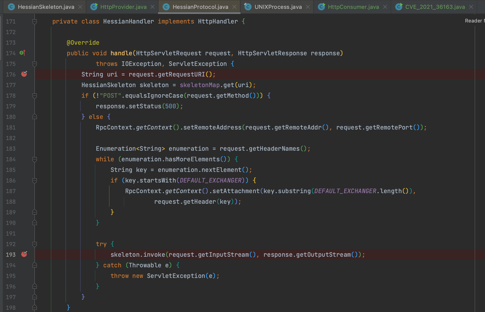

该接口通过 `org.apache.dubbo.remoting.http.servlet.DispatcherServlet#service()` 调用，这里我们看到通过请求端口选择对应的 handler，和之前复现时配置都差不多，小改一下换成 hessian 就行。

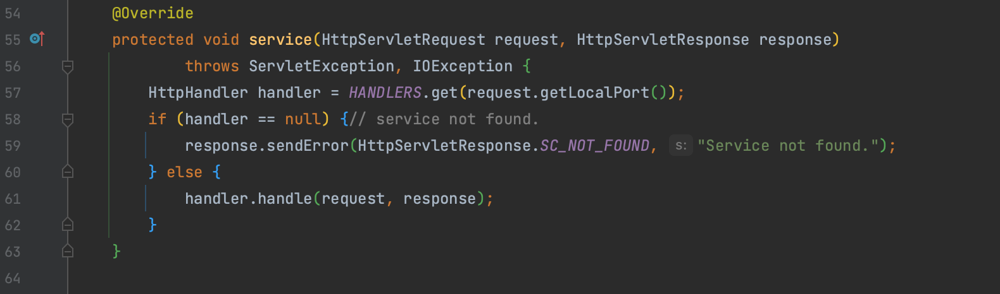

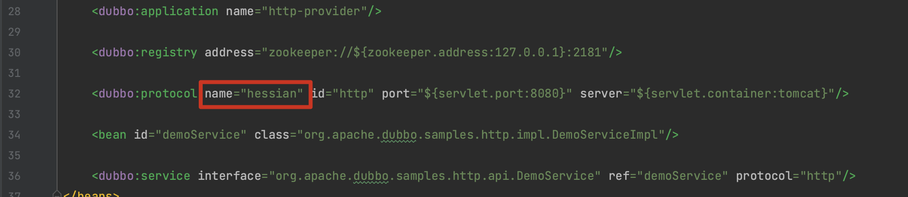

断点调试 `org.apache.dubbo.rpc.protocol.hessian.HessianProtocol.HessianHandler#handle()` 方法，将 POST 方法传入的请求对象用于反序列化，并且不存在安全 Factory 过滤。

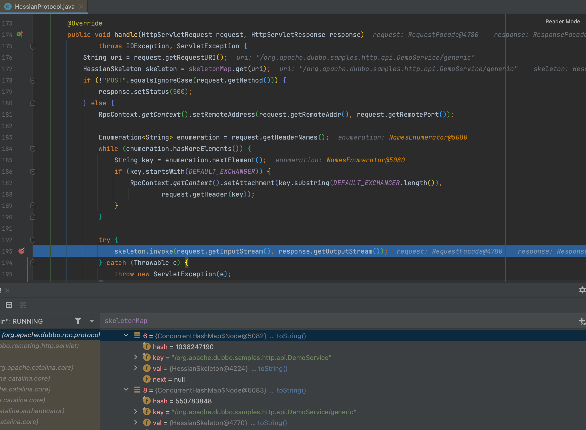

这里我们可以看到存在两个 Path，`/org.apache.dubbo.samples.http.api.DemoService` 不能触发，通告披露的`/org.apache.dubbo.samples.http.api.DemoService/generic` 却可以，看一看 `exporterMap` 是怎么赋值的。

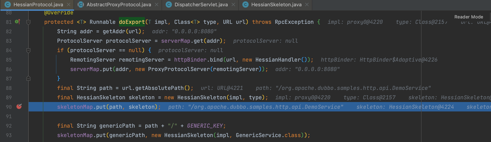

`exporterMap` 通过 `org.apache.dubbo.rpc.protocol.hessian.HessianProtocol#doExport()` 赋值，前后添加了两个 `HessianSkeleton` 对象，第一个是 DemoService ，所以最后只能调用他的 `sayHello` 方法，而 `org.apache.dubbo.rpc.service.GenericService` 是存在 `$invoke` 的，这也是为什么在写 payload 的时候用到了 `$invoke`，并且依次写入了需要的参数。

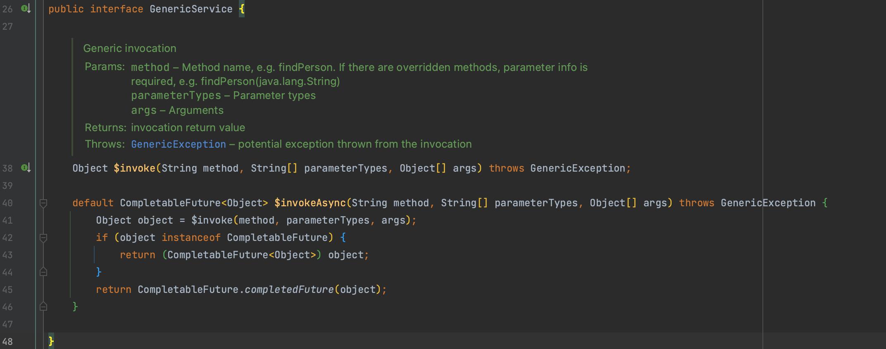

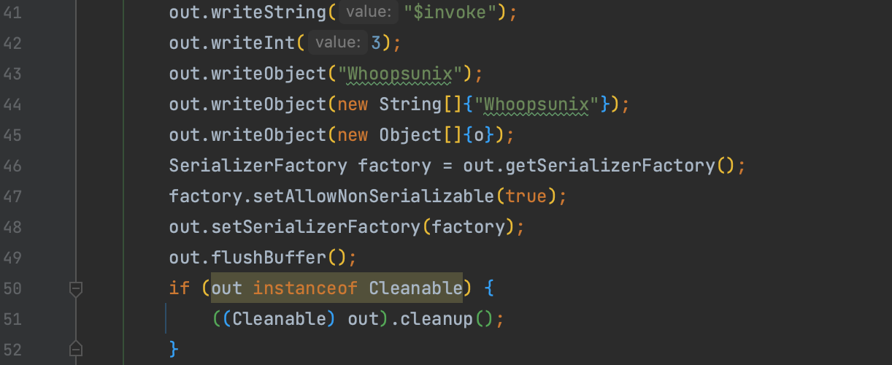

所以定义一个 Object 接口，只要 payload 的参数类型一致也是可以触发的。那么在 telnet 可以连接到 dubbo 端口的时候，我们已知接口名，只需要爆破参数就能攻击了，这也是很多工具实现时用到的参数爆破。当然这就是题外话了，我们完全可以使用 `$invoke`。

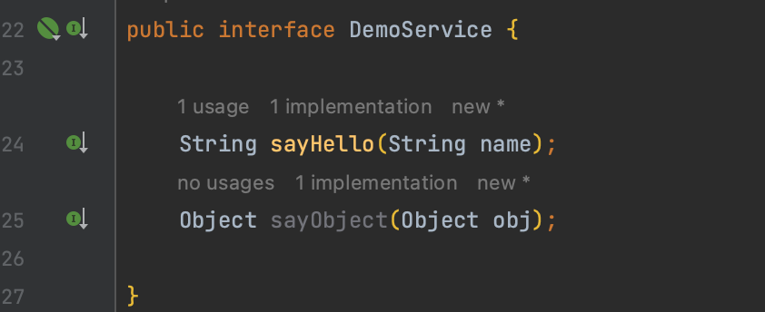

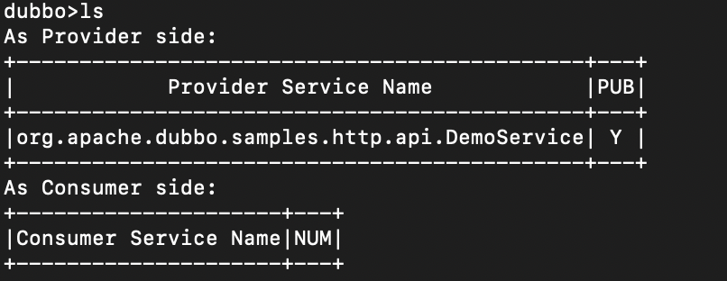

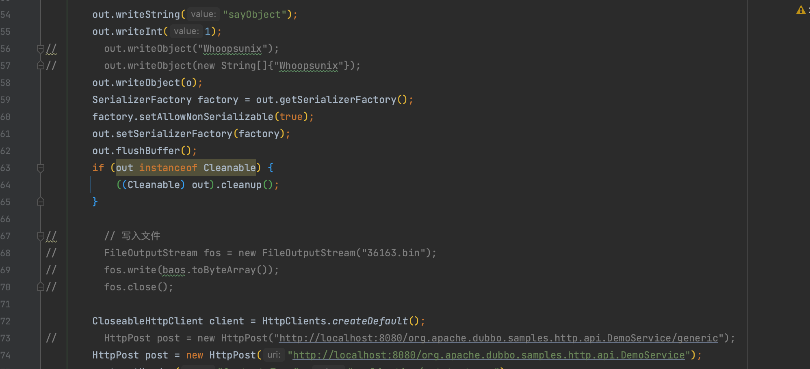

## 补丁

设置安全 Factory

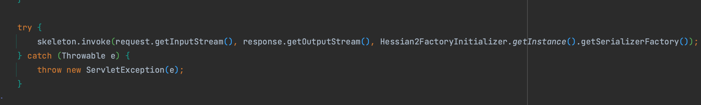
