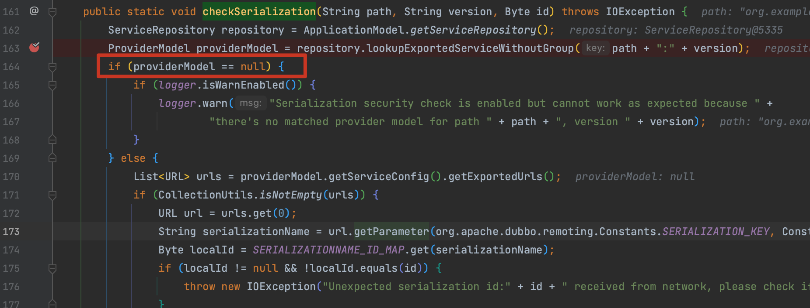
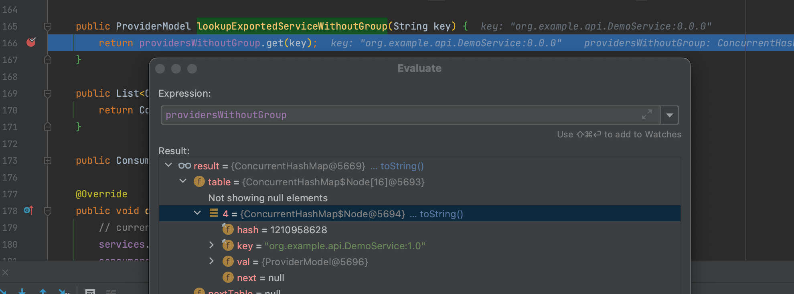
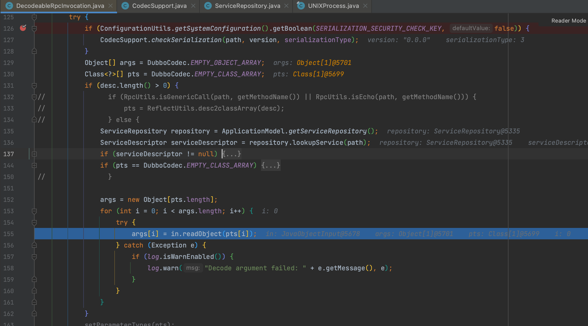
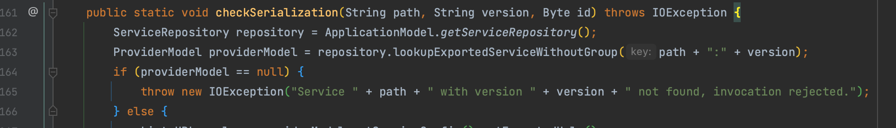

# CVE-2021-37579 Apache Dubbo 反序列化安全检查绕过

## 概述

### 影响版本

[2.7.0, 2.7.12]、[3.0.0, 3.0.1]

## 复现分析

这个洞的话，就是 `System.setProperty("serialization.security.check", "true");` 的绕过，开启该配置后，就会进入 `org.apache.dubbo.remoting.transport.CodecSupport#checkSerialization()` 方法。

当 prividerModel 为 null 时，会打印告警日志，程序还是接着往下走，而这个对象通过 `org.apache.dubbo.rpc.model.ServiceRepository#lookupExportedServiceWithoutGroup()` 获取。

而这个类也很简单，就是看 providersWithoutGroup 是否定义了相应请求的 provider

即使不存在也不影响后续的反序列化。

## 补丁

补丁改成抛出异常。

