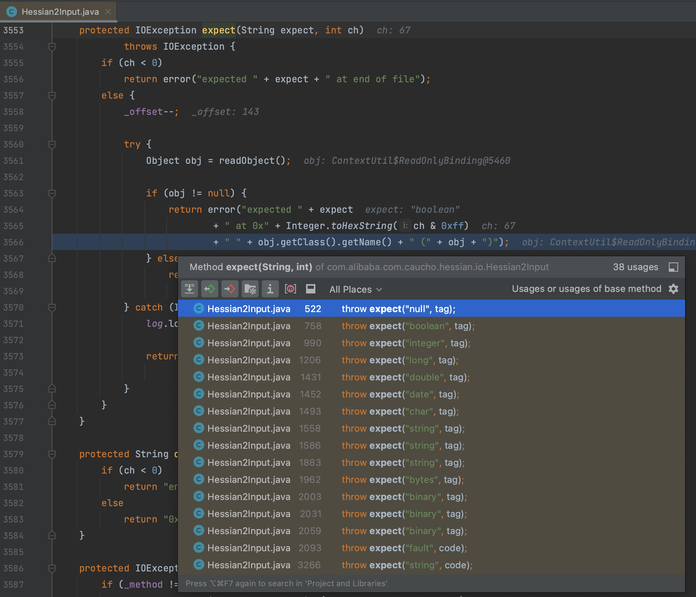
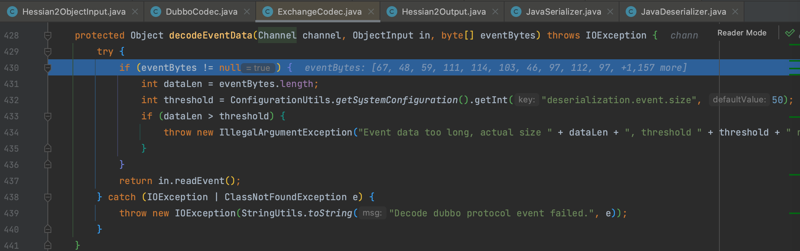
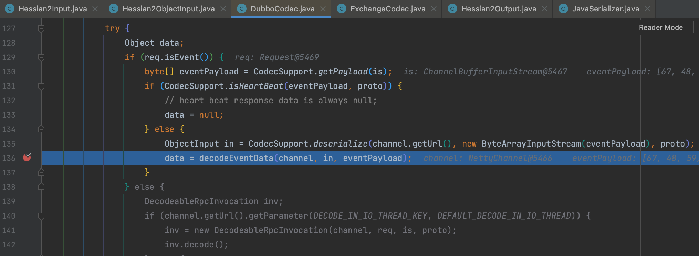
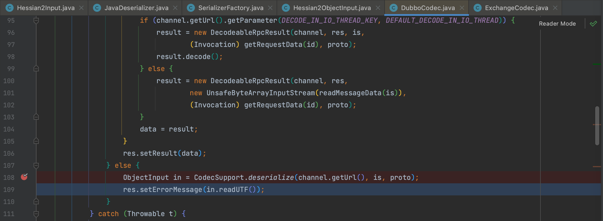
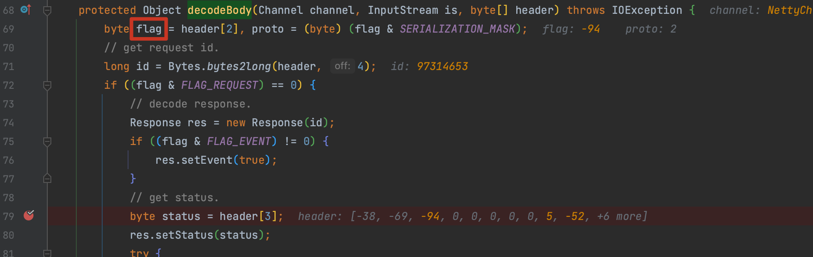
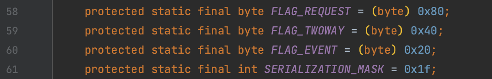

# CVE-2021-43297 Apache Dubbo Hessian-Lite 反序列化漏洞

## 概述

### 影响版本

[2.7.0, 2.7.12]、[3.0.0, 3.0.1]

## 复现分析

直接定位到补丁的 [commit](https://github.com/apache/dubbo-hessian-lite/commit/ca45bf8f8f41c6e5f7fb96c8cc6b409384de9a18) ，移除了直接对象打印，我们知道 bean 对象输出时会直接调用其 `toString()` 方法，在 commit 修改的方法中有一个 `com.alibaba.com.caucho.hessian.io.Hessian2Input#expect()` 我们可以看到被用于 `Hessian2Input` 类的各个 `read` 方法中异常抛出时调用。所以我们可以用 `toString()` 触发 sink 方法的 Hessian 调用链进行攻击。

而该方法是在没找到对应序列化 tag 时进入 default 分支中被调用，所以这个洞的实际利用还是构造特殊的 Hessian 序列化数据，关于这部分的详细分析可以参考 [bitterzzZZ师傅的分析](https://github.com/bitterzzZZ/CVE-2021-43297-POC?tab=readme-ov-file) 就不赘述，继续跟一下在 2.7.9 后不能利用的绕过的原因，在 `org.apache.dubbo.remoting.exchange.codec.ExchangeCodec#decodeEventData()` 方法中，字节数组长度大于 50 抛出异常。

### 2.7.9后

重点关注漏洞触发方法 `org.apache.dubbo.rpc.protocol.dubbo.DubboCodec#decodeBody()` 以 2.7.12 为例该方法是在 136 行调用 `decodeEventData()`。

同样是在 `DubboCodec` 类还有一处调用了 `Hessian2ObjectInput#readUTF()` 的方法。

要进入该分支需要满足如下条件，通过 flag 值来指定通过 `header[2]` 指定，该值同时还用于选择序列化类型

## 补丁

补丁 [commit](https://github.com/apache/dubbo-hessian-lite/commit/ca45bf8f8f41c6e5f7fb96c8cc6b409384de9a18) 即针对 hessian 的修复

**参考**

https://github.com/bitterzzZZ/CVE-2021-43297-POC?tab=readme-ov-file

