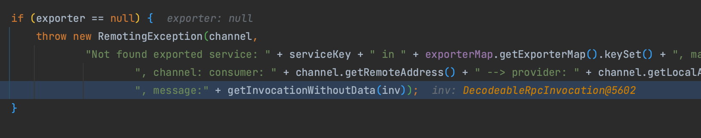
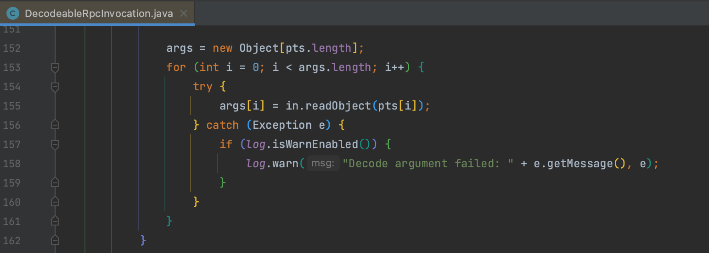

# CVE-2022-39198 Apache Dubbo Hessian-Lite 反序列化漏洞

## 概述

### 影响版本

3.1.0、[2.7.0, 2.7.17]、[3.0.0, 3.0.11]

## 复现分析

这个漏洞的分析可以看到 [yemoli 师傅的博客](https://yml-sec.top/2022/12/30/%E4%BB%8Ecve-2022-39198%E5%88%B0%E6%98%A5%E7%A7%8B%E6%9D%AFdubboapp/) 写的很详细，还是看到 `org.apache.dubbo.rpc.protocol.dubbo.DecodeableRpcInvocation#decode()` 方法，这次不再是利用之前的 `readObject()`入口点，而是使用 `decodeInvocationArgument()` 这个方法。

继续跟进到 `org.apache.dubbo.rpc.protocol.dubbo.DubboProtocol#getInvoker()` 方法，会从 `exporterMap` 种获取一个 exporter ，可以看到这个 Map 中只有我们自己实现的 `org.example.api.DemoService:1.0:12345` 接口，而我们传入的是 `org.apache.dubbo.metadata.MetadataService:1.0.0:12345` ，所以无法获取到 exporter ，抛出异常。

而这个 inv 是继承 `org.apache.dubbo.rpc.RpcInvocation` 的，因此最终会调用 `org.apache.dubbo.rpc.RpcInvocation#toString()` ，之后用 `toString()` 的调用链就可以利用了。

### sun.print.UnixPrintServiceLookup

复现使用的是 KCON2023 议题[《Magic In Java API》](https://github.com/knownsec/KCon/blob/master/2023/Magic%20In%20Java%20Api.pdf) 提到的 `sun.print.UnixPrintServiceLookup` 这个类，利用方法是 `sun.print.UnixPrintServiceLookup#getDefaultPrintService()` ，这里篇幅有限不展介绍。这里用 Mac 的话有坑点，需要满足这两个条件，复现的时候要注意一下。

最终在 `sun.print.UnixPrintServiceLookup#execCmd` 触发。

**参考**

> https://yml-sec.top/2022/12/30/%E4%BB%8Ecve-2022-39198%E5%88%B0%E6%98%A5%E7%A7%8B%E6%9D%AFdubboapp/
>
> https://xz.aliyun.com/t/12818

## 补丁

后续这个漏洞在 `org.apache.dubbo.rpc.protocol.dubbo.DecodeableRpcInvocation#decode()` 方法的这个 `readObject()` 通过 Hessian 黑名单来限制。

