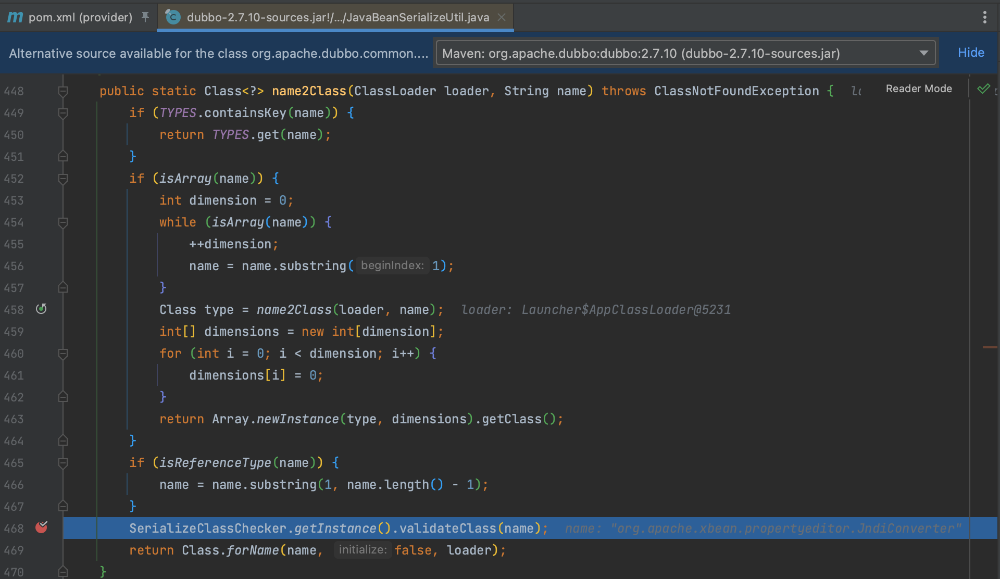

# CVE-2023-23638 Apache Dubbo 反序列化漏洞

## 概述

### 影响版本

[2.7.0, 2.7.21]、[3.0.0, 3.0.13]、[3.1.0, 3.1.5]

## 复现分析

这个漏洞可以看作是 CVE-2021-30179 的延伸，所以事实上还是一个泛化调用问题，之前我们分析到这个漏洞使用 `SerializeClassChecker` 进行黑名单验证。

`validateClass()` 方法会判断 `OPEN_CHECK_CLASS` 属性值，为 false 时跳出检查。

而这个值是通过 `getInstance()` 方法获取的，这段代码实现了单例模式，提供了全局访问点来获取该实例，所以可以通过修改该 `INSTANCE` 实现利用，除了修改 `OPEN_CHECK_CLASS` 值，还可以修改 `validateClass()` 方法中任意值来绕过，比如黑名单列表 `CLASS_DESERIALIZE_BLOCKED_SET`。

**参考**

> https://xz.aliyun.com/t/12396

