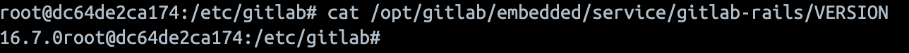

# GitLab

## 0x00 环境搭建

```
docker pull gitlab/gitlab-ce:16.7.0-ce.0

docker run -d -p 1180:80 -p 11443:443 -p 1122:22 gitlab/gitlab-ce:16.7.0-ce.0

账号：root
email: admin@example.com
密码：cat /etc/gitlab/initial_root_password
Password: 6oOPL/xOP4eNQ6x3PeOY/+aCsDGi2DLBTVIqAH6ZNxs=

```

## 0x01 信息获取

### 版本号

```
cat /opt/gitlab/embedded/service/gitlab-rails/VERSION

登录后访问 http://127.0.0.1:1180/help
```



## 0x02 配置文件

位于 /etc/gitlab/gitlab.rb

### [Set a CSP](https://docs.gitlab.com/omnibus/settings/configuration.html#set-a-content-security-policy)

添加 CSP

```
gitlab_rails['content_security_policy'] = {
    enabled: true,
    report_only: false,
    directives: {
      default_src: "'none'",
      script_src: "https://example.com"
    }
}

```

### [Set allowed hosts to prevent host header attacks](https://docs.gitlab.com/omnibus/settings/configuration.html#set-allowed-hosts-to-prevent-host-header-attacks)

```
gitlab_rails['allowed_hosts'] = ['gitlab.example.com']
```

### [数据库配置](https://docs.gitlab.com/omnibus/settings/database.html)

默认不提供远程访问，如果配置了就能操作

```
# gitlab_rails['db_database'] = "gitlabhq_production"
# gitlab_rails['db_username'] = "gitlab"
# gitlab_rails['db_password'] = nil
# gitlab_rails['db_host'] = nil
# gitlab_rails['db_port'] = 5432
```

