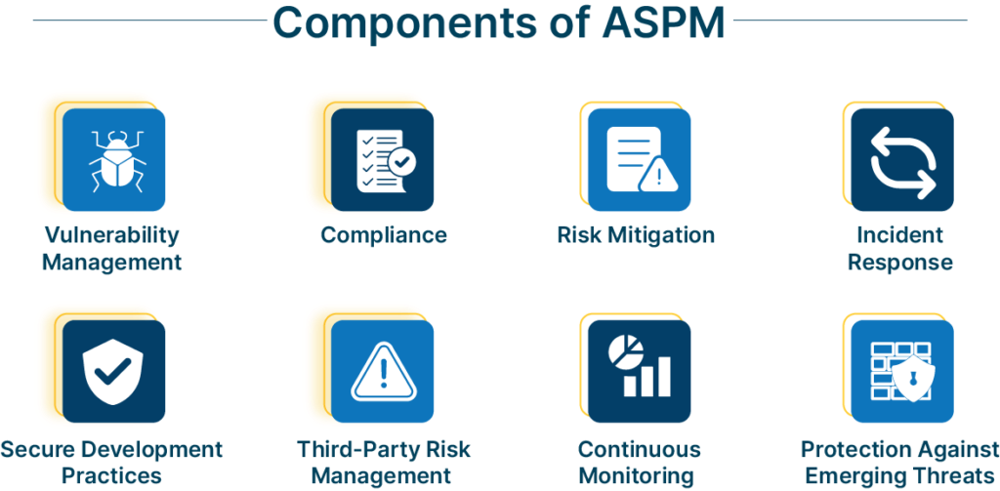

# ASPM (Application Security Posture Management) 应用程序安全态势管理

## 0x00 总结

ASPM 不单单涉及单个应用，也不仅仅是一个管理方法，实际上是各种最佳实践的整理过程，包括组织应用程序的全面管理和评估。主要解决工具蔓延和数据分散的问题，核心思路在于如何解决孤岛效应，满足安全状态可见性需求，形成应用运行状态的统一视图，类似 SBOM（Software Bill of Materials 软件物料清单）。

## 0x01 功能实践

如图所示分为八个功能

### 主要功能

漏洞管理、事件响应：主要、基本功能

合规信息：国外的 ASPM 产品都有这方面的能力，国内目前没看到。个人认为这个对于金融行业很重要，因为有应用统一识图可以清楚的知道还有哪些应用不符合标准，实际不符合标准的应用多为老系统，相当于在接入视图时强调了这类分支系统的威胁。

安全开发实践：安全编码规范、基于角色的访问控制、用户身份验证/授权、安全测试。

三方风险管理：主要还是针对开源软件组成的风险。

### 其他

风险缓解：通过 ASPM 计划来帮助组织优先考虑和解决最关键的安全问题，很难实施，实际上更愿意看到的是定制化的 DevSecOps 方案。

新兴威胁：威胁情报的利用，这个有点鸡肋，首先是有成熟的威胁情报平台了，市场表现并不算好，作为一个功能去存在维护成本和产出较大，如果有现有产品那可以考虑集成。

## 0x02 期望效果

将 ASPM 集成到 CI/CD 流程中需要收获以下效益

### 减少AppSec孤岛

个人认为应用统一识图是 ASPM 这个理念的最大好处，具体的漏洞检测、防护都有具体的 AST 平台来实现，需要的就是给予应用安全最大的可见性，将应用、工具、安全数据都汇总到一块，合规统计、减少重复漏洞的效果都得看这个图的构建效果。具体表现为以下效应：

1. 程序可见：资产全面性梳理
2. 数据收集：用于漏洞管理、合规统计
3. 风险可见：基于前两步的信息来定制漏洞补救优先级任务
4. 依赖关系映射：各个程序间的依赖关系、数据流通情况

### 安全测试自动化

1. 将安全工具与 CI/CD 集成，类似工具箱的角色
2. 将 SAST、DAST、SCA 等 AST 安全检查自动化

### 结构化方案

#### 安全左移

#### 漏洞补救

同样是基于应用统一视图的思想、风险可见能力，可以给出结构化的漏洞修复计划，这一点其实可以和其他最佳实践结合起来，比如 RASP 针对性业务场景。

### 识别错误配置

crowdstrike 给出的说法是检测应用程序和应用程序的部署环境的配置错误，所以还是应用为主。并且有一个类似概念 CSPM 需要加以区分，哪怕 ASPM 部署在云环境也只是监控云环境中的应用程序，而不是云环境本身。

## 0x03 相关概念

### SBOM

SBOM是与应用程序相关的所有软件组件、依赖项和元数据的综合列表。SBOM的功能是组成软件产品的所有构建块的库存。有了它，组织可以更好地理解、管理和保护他们的应用程序。

- Ensuring software transparency 确保软件透明度
- Managing open-source software and third-party dependencies 管理开源软件和第三方依赖关系
- Identifying and mitigating security vulnerabilities 识别和缓解安全漏洞
- Complying with legal and regulatory requirements 遵守法律的和法规要求

## 0x04 讨论

针对 ASPM 一个有意思的讨论，提取其中重要信息  https://escape.tech/blog/aspm-james-berthoty-latio-tech/ 

1. ASPM 包含了 ASOC ，相当于在此基础上添加了扫描功能
2. 

**参考**

> cycode
>
> https://cycode.com/
>
> https://cycode.com/aspm-application-security-posture-management/
>
> opsmx
>
> https://www.opsmx.com/blog/security-and-compliance-best-practices-for-ci-cd-pipelines-in-2023/
>
> https://www.opsmx.com/blog/what-is-aspm-explained-and-why-should-you-care/
>
> crowdstrike
>
> https://www.crowdstrike.com/cybersecurity-101/cloud-security/application-security-posture-management-aspm/
>
> https://www.crowdstrike.com/cybersecurity-101/aspm-use-cases/
>
> fluidattacks
>
> https://fluidattacks.com/product/aspm/
>
> snyk
>
> https://snyk.io/product/snyk-apprisk/?utm_medium=paid-search&utm_source=google&utm_campaign=nb_ba_appsec&utm_content=aspm-aw&utm_term=aspm&gad_source=1&gclid=Cj0KCQjwqdqvBhCPARIsANrmZhN9mWrofnfyn32spIJpUh8aKq9kN8owzKCupshxfvOZUJ-9H1VL8EgaAmxuEALw_wcB

