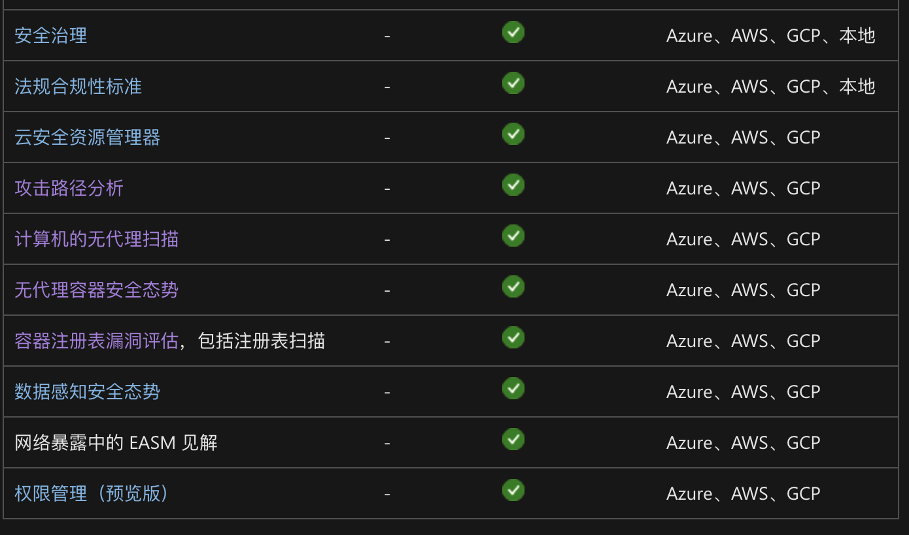

# CSPM (Cloud Security Posture Management) 云安全态势管理

## 0x00 总结

CSPM 专门针对云环境中的合规性风险和错误配置，通过持续监控为云环境提供合规性保证（IaaS、Saas、PaaS），通常用于风险可视化和评估、合规性监控、DevSecOps集成和事件响应等，这个过程是自动化的。

## 0x01 功能

### 数据来源

CSPM 的基本数据来自基础设施即代码（IaC）配置、容器映像和云虚拟机（VM）映像等，基本上每一个 CSPM 都有这方面的数据收集能力。真正做到差异化的是威胁数据的关联能力，例如网络异常结合用户和实体行为分析（UEBA）数据来共同构建。但是实际上数据非常复杂，总是离不开手动干预。

### 特定功能

云厂商都会提供其特定的 CSPM 服务，除了基础功能外都会针对自己的使用环境提供定制化 CSPM，例如微软针对其 win  server 服务器提供了很多特色化服务。

## 0x02 局限

对于 CSPM 并不打算多做介绍，因为单独这个概念很难长久存在市场中，CSPM 的基础功能简单来说就是围绕元资源配置赋予可见性、治理和合规性。特定功能以微软举例是因为能从他功能发展方向中看到一些端倪，权限管理其实更应该是 CIEM（cloud infrastructure entitlement management）的内容，CSPM 的定位原本并不会深入身份和访问管理（IAM）。同样的还有 Iac 安全、CNAPP 等方向都有对 CSPM 的能力有所涵盖。

**参考**

> microsoft
>
> https://learn.microsoft.com/zh-cn/azure/defender-for-cloud/concept-cloud-security-posture-management
>
> aliyun
>
> https://www.aliyun.com/product/cspm
>
> 
>
> https://www.paloaltonetworks.com/cyberpedia/what-is-cloud-security-posture-management