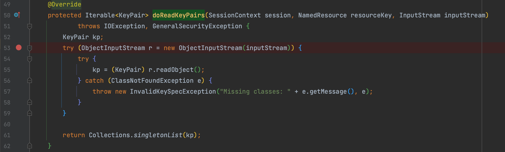

# CVE-2022-45047 Apache MINA 反序列化sink点

By. Whoopsunix

# 0x00 概述

[环境](https://github.com/Whoopsunix/PPPVULNS/tree/master/sinks/MINASSHDDemo)

[补丁](https://github.com/apache/mina-sshd/commit/5a8fe830b2a2308a2b24ac8115a391af477f64f5#diff-ae34d3a1529f7942e1a47771dd21724c3fef1c7568d3f8455ed9efad96d748ba)

影响版本 org.apache.sshd:sshd-common@(-∞, 2.9.2)

# 0x01 sink点

`org.apache.sshd.server.keyprovider.SimpleGeneratorHostKeyProvider#doReadKeyPairs` 直接对传入的 `InputStream` 反序列化

