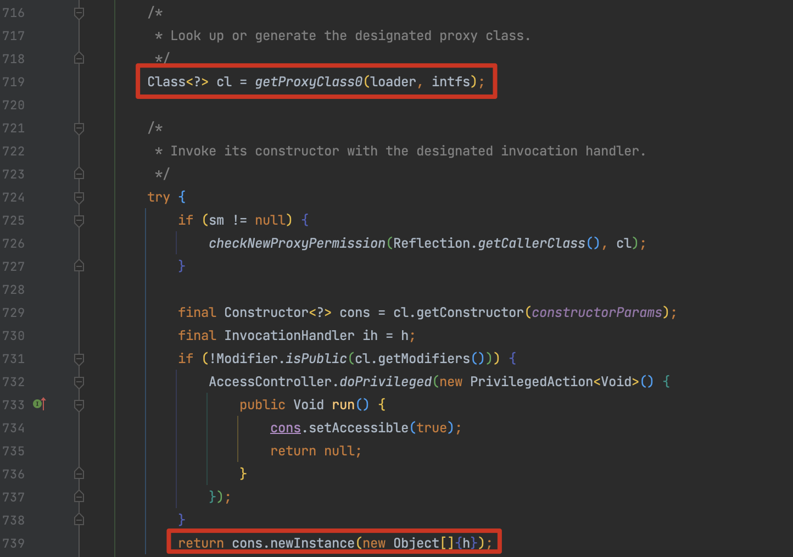
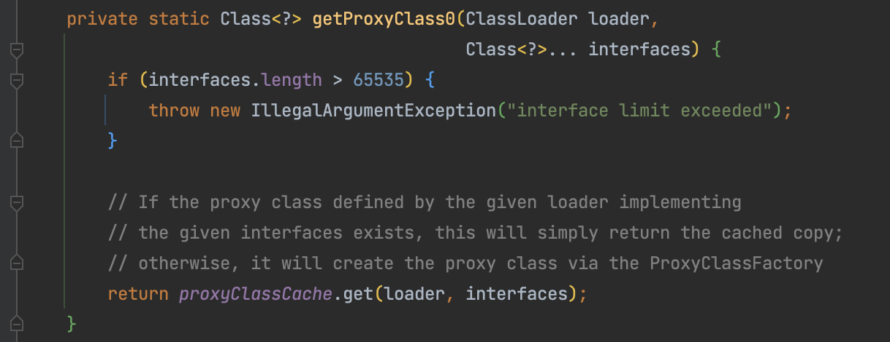
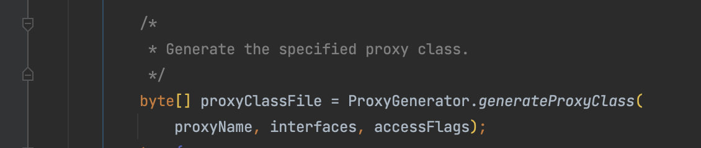
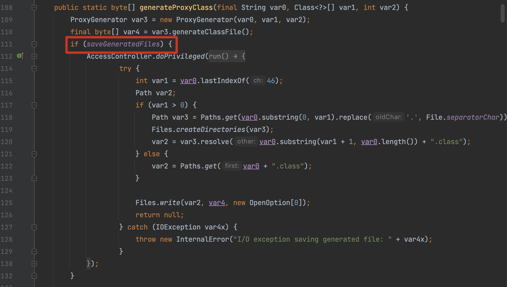
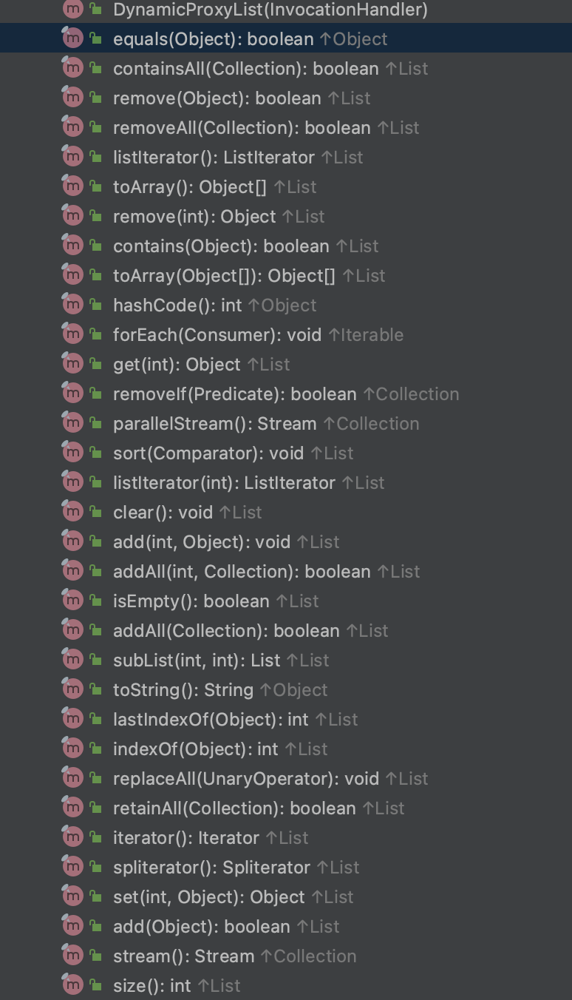
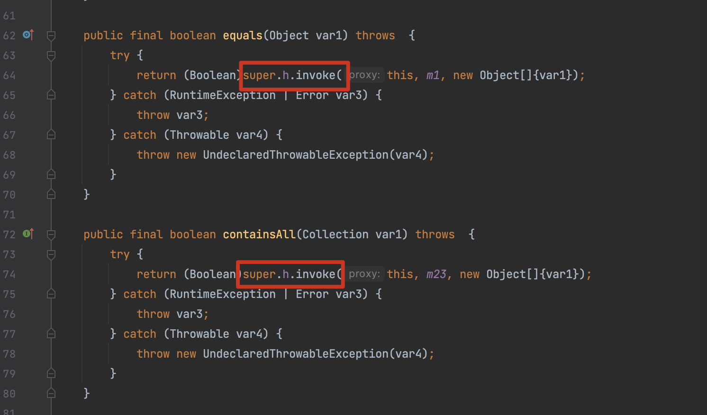

# Java 基础

By. Whoopsunix

基础知识推荐阅读 [javaweb-sec](https://github.com/javaweb-sec/javaweb-sec) 项目，写的很全

# 0x01 ClassLoader

关于 ClassLoader 的 [官方定义](https://docs.oracle.com/javase/8/docs/api/java/lang/ClassLoader.html) ，简单来说 Java 作为一个依赖 JVM 的编译型语言，一切类都需要经过 JVM 加载后才能运行，而 `ClassLoader` （类加载器）负责的也是这部分功能，将类文件从磁盘或网络加载到内存中，并将其转换为`Class`对象，使应用程序可以使用这些类。

+ Bootstrap ClassLoader：这是最顶层的类加载器，负责加载Java核心类库（如java.lang包中的类）以及其他核心资源。它通常是由Java虚拟机实现的一部分，不是Java代码。
+ Extension ClassLoader：它是 `sun.misc.Launcher$ExtClassLoader` 的实例，用于加载Java的扩展类，通常位于 `<JAVA_HOME>/lib/ext` 目录下。这些类不是核心类，但是扩展了Java的功能。
+ System ClassLoader：这也是我们关注最多的一个加载器，它是  `sun.misc.Launcher$AppClassLoader` 的实例。
    + `AppClassLoader` 是应用程序默认的类加载器，用于加载应用程序类。所以 `ClassLoader.getSystemClassLoader();` 获取到的也是 `AppClassLoader`

## 核心方法

loadClass：用于加载指定名称的类，`ClassLoader.loadClass()` 默认不会触发静态方法和属性，而 `Class.forName` 除了调用 `loadClass` 外还会调用静态方法。

findClass：抽象方法，由子类实现。它负责查找并加载指定名称的类文件。

defineClass：将一个类字节数组转换为Class对象

resolveClass：通常用于链接或解析类，例如在类加载之后解析类的依赖关系或执行其他与类解析相关的操作，在类加载后被调用。

## 常见用于类加载的 ClassLoader

URLClassLoader：提供了加载远程资源的能力

BCEL ClassLoader：解析带有 `$$BCEL$$` 的字符串实现类加载，在 JDK8u241 之前可以使用

TransletClassLoader：yso 中用到的加载类字节码的方法，经常配合一些存在成员变量映射（get）的方法实现利用，比如 fastjson、jackson。

## Unsafe

Unsafe 类和 ClassLoader 之间没有直接的继承或关系，不过该类经常用作类加载，所以写到一起。Unsafe 类提供了对Java虚拟机内部的低级操作的访问，允许直接操作内存、执行CAS操作、操纵对象的字段、创建实例等。

上述例子在 [JavaRce](https://github.com/Whoopsunix/JavaRce/tree/main/Serialization/ClassLoad) 中都有 Demo

# 0x02 反射

Java的反射（Reflection）是一种强大的机制，允许在运行时检查和操作类、对象、方法和属性的信息。它提供了一种动态获取类的信息和执行对象方法的方式，可以实现很多高级的编程技巧。

## 获取类

```java
//静态变量class获取
Class cls1 = String.class;
//变量的getClass()方法
String str = "ppp";
Class cls2 = str.getClass();
// 知道完整类名使用静态方法Class.forName()
Class cls3 = Class.forName("java.lang.String");
// ClassLoader获取
Class cls4 = ClassLoader.getSystemClassLoader().loadClass("java.lang.Runtime");
```

## 构造方法

```java
public static Constructor<?> getFirstConstructor(String name) throws Exception {
    // 第一个构造方法
    Constructor<?> constructor = Class.forName(name).getDeclaredConstructors()[0];
    constructor.setAccessible(true);
    return constructor;
}

public static Object newInstance(String className, Object... args) throws Exception {
    return getFirstConstructor(className).newInstance(args);
}
```

## 获取/修改属性值

```java
    // field
    public static Field getField(Class<?> clazz, String fieldName) {
        Field field = null;
        try {
            field = clazz.getDeclaredField(fieldName);
            field.setAccessible(true);
        } catch (NoSuchFieldException e) {
            if (clazz.getSuperclass() != null)
                field = getField(clazz.getSuperclass(), fieldName);
        }

        return field;
    }

    public static void setFieldValue(Object obj, String fieldName, Object value) throws Exception {
        Field field = getField(obj.getClass(), fieldName);
        field.set(obj, value);
    }

    public static Object getFieldValue(Object obj, String fieldName) throws Exception {
        Field field = getField(obj.getClass(), fieldName);
        return field.get(obj);
    }
```

## 调用方法

```java
public static void method(Object obj, String methodName, Object... args){
    try {
        Class<?>[] argsClass = new Class[args.length];
        for (int i = 0; i < args.length; i++) {
            argsClass[i] = args[i].getClass();
            if(argsClass[i].equals(Integer.class))
                argsClass[i] =Integer.TYPE;
            else if(argsClass[i].equals(Boolean.class))
                argsClass[i] =Boolean.TYPE;
            else if(argsClass[i].equals(Byte.class))
                argsClass[i] =Byte.TYPE;
            else if(argsClass[i].equals(Long.class))
                argsClass[i] =Long.TYPE;
            else if(argsClass[i].equals(Double.class))
                argsClass[i] =Double.TYPE;
            else if(argsClass[i].equals(Float.class))
                argsClass[i] =Float.TYPE;
            else if(argsClass[i].equals(Character.class))
                argsClass[i] =Character.TYPE;
            else if(argsClass[i].equals(Short.class))
                argsClass[i] =Short.TYPE;
        }
        Method method = obj.getClass().getDeclaredMethod(methodName, argsClass);
        method.invoke(obj, args);

    } catch (Exception e) {
        e.printStackTrace();
    }
}
```

# 0x03 Java 代理机制

Java代理机制是一种重要的编程技术，允许一个对象（代理对象）充当另一个对象（目标对象）的接口，用于控制对目标对象的访问。代理模式有多种应用，包括实现AOP（面向切面编程）、实现远程方法调用（RMI）、实现懒加载，以及实现日志记录和性能监控等。在Java中，代理通常有两种主要形式：

## 静态代理

静态代理比较好理解，在编译时就创建好代理类一块打包。代理类通常需要实现与目标对象相同的接口，然后通过方法调用委托给目标对象。因为这种代理是显式的，所以需要手动创建代理类，比如以下例子：

```java
    interface User {
        public void sayHello();
    }

    class User1 implements User {
        @Override
        public void sayHello() {
            System.out.println("hello");
        }
    }

    class StaticProxy implements User {
        private User user;

        public StaticProxy(User user) {
            this.user = user;
        }

        @Override
        public void sayHello() {
            System.out.println("do something pre");
            user.sayHello();
            System.out.println("do something end");
        }
    }
```

## 动态代理

动态代理是在运行时创建代理类的方式。Java的 `java.lang.reflect.Proxy` 和CGLIB库提供了动态代理的支持。代理类在运行时生成，不需要手动编写。

而如果要在程序运行期间生成代理对象，组需要通过反射的方式实现。代理类需要实现 `java.lang.reflect.InvocationHandler`，重写 `invoke()` 方法添加逻辑，然后通过 `java.lang.reflect.Proxy#newProxyInstance()` 去生成动态类和访问实例。这样做无论传入的是什么类，都可以调用我们想额外增加的方法。

```java
class DynamicProxy implements InvocationHandler {
    private Object targetObj;

    @Override
    public Object invoke(Object proxy, Method method, Object[] args) throws Throwable {
        System.out.println("do something dynamic pre");
        Object obj = method.invoke(targetObj, args);
        System.out.println("do something dynamic end");
        return obj;
    }

    public Object getInstance(Object targetObj) {
        this.targetObj = targetObj;
        return Proxy.newProxyInstance(targetObj.getClass().getClassLoader(), targetObj.getClass().getInterfaces(), this);
    }
}


@Test
public void testDynamicProxy(){
    List<String> dynamicProxyList = (List<String>) new DynamicProxy().getInstance(new ArrayList<String>());
    dynamicProxyList.add("123");
}
```

在实现了简单的demo后，跟进 `Proxy.newProxyInstance()` ，首先是生成代理类，然后调用 `newInstance()` 进行实例化。



跟进代理类的生成，会先从缓存中去获取，当获取不到时会使用 `ProxyClassFactory` 去创建，跟进后就能看到调用了 `ProxyGenerator.generateProxyClass()` 方法





`ProxyGenerator.generateProxyClass()` 中存在一个 `saveGeneratedFiles`参数，当为true时会将生成的代理类存储在磁盘，通过以下命令开启 `System.getProperties().put("sun.misc.ProxyGenerator.saveGeneratedFiles", "true");`



分析生成的文件，动态代理类中代理了显示定义的接口中的方法，还代理了从 Object继承来的三个方法 `equals()、hashcode()、toString()` ，这个性质很重要，在分析调用链的时候会发现很多 gadget 都用到了这个性质。



其实动态代理的思路到这很明确了，就是实现所有的接口、有所有的方法，然后对原先方法的所有调用都通过 `InvocationHandler.invoke()` 去调用，就可以实现需要的逻辑增强。



# 0x04 反编译

https://github.com/fesh0r/fernflower